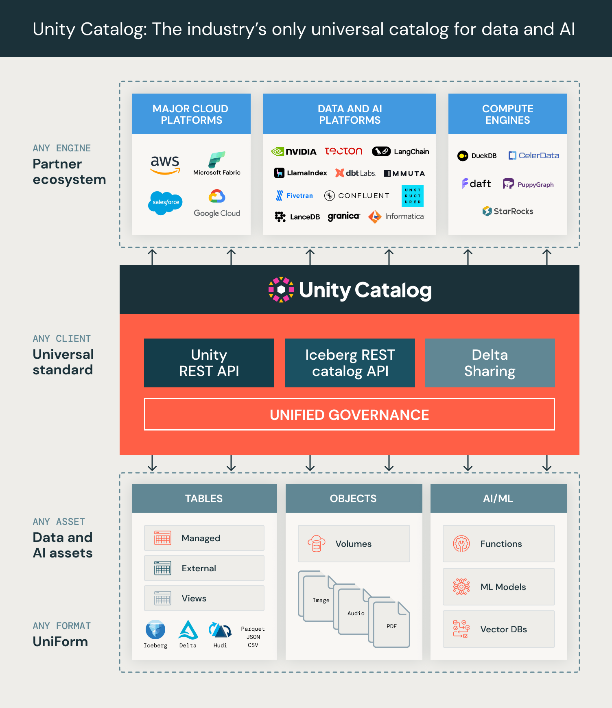

# Unity Catalog: Open, Multi-modal Catalog for Data & AI
Unity Catalog is the most open and interoperable catalog for data and AI 
- **Multimodal interface supports any format, engine, and asset**
  - Multi-format table support - Delta Lake, Apache Iceberg as UniForm, Apache Parquet, CSV, etc.
  - Beyond tables - Unstructured data (Volumes) and AI assets (ML models, Gen AI tools)
  - Plugin support - extensible to Iceberg REST Catalog and HMS interface for client compatibility, 
    plus additional plugins (e.g., integration with a new AI framework)
  - Interoperates with the [Delta Sharing open protocol](https://delta.io/sharing/) for sharing tabular and non-tabular assets cross-domain
- **Fully Open** - OpenAPI spec and OSS implementation (Apache 2.0 license)
- **Unified governance** for data and AI - Asset-level access control is enforced through 
    temporary credential vending via REST APIs



## Quickstart - Hello UC!
Let's take Unity Catalog for spin. In this guide, we are going to do the following:
- In one terminal, run the UC server.
- In another terminal, we will explore the contents of the UC server using a CLI. 
  An example project is provided to demonstrate how to use the UC SDK for various assets
  as well as provide a convenient way to explore the content of any UC server implementation.

### Prerequisites
- Docker

OR

You have to ensure that you local environment has the following:
- Clone this repository.
- Ensure the `JAVA_HOME` environment variable your terminal is configured to point to JDK11+.
- Compile the project using `build/sbt package`

### Run the UC Server
```shell
docker run -d -i --name unitycatalog -p 8081:8081 datacatering/unitycatalog:0.1.0
```


In a terminal, in the cloned repository root directory, start the UC server.

```
bin/start-uc-server
```

For the rest of the steps, continue in a different terminal.

### Operate on Delta tables with the CLI
Let's list the tables. 
```
bin/uc table list --catalog unity --schema default
```
You should see a few tables. Some details are truncated because of the nested nature of the data.
To see all the content, you can add `--format jsonPretty` to any command.

Next, let's get the metadata of one those tables. 

```
bin/uc table get --full_name unity.default.numbers
```

You can see that it is a Delta table. Now, specifically for Delta tables, this CLI can
print snippet of the contents of a Delta table (powered by the [Delta Kernel Java](https://delta.io/blog/delta-kernel/) project).
Let's try that.

```
bin/uc table read --full_name unity.default.numbers
```

### Operate on Delta tables with DuckDB

For trying with DuckDB, you will have to [install it](https://duckdb.org/docs/installation/) (at least version 1.0).
Let's start DuckDB and install a couple of extensions. To start DuckDB, run the command `duckdb` in the terminal.
Then, in the DuckDB shell, run the following commands:
```sh
install uc_catalog from core_nightly;
load uc_catalog;
install delta;
load delta;
```
If you have installed these extensions before, you may have to run `update extensions` and restart DuckDB 
for the following steps to work.

Now that we have DuckDB all set up, let's trying connecting to UC by specifying a secret. 
```sh
CREATE SECRET (
      TYPE UC,
      TOKEN 'not-used',
      ENDPOINT 'http://127.0.0.1:8080',
      AWS_REGION 'us-east-2'
 );
```
You should see it print a short table saying `Success` = `true`. Then we attach the `unity` catalog to DuckDB.
```sh
ATTACH 'unity' AS unity (TYPE UC_CATALOG);
```
Now we ready to query. Try the following

```sql
SHOW ALL TABLES;
SELECT * from unity.default.numbers;
```

You should see the tables listed and the contents of the `numbers` table printed.
TO quit DuckDB, run the command `Ctrl+D` or type `.exit` in the DuckDB shell.

## Full Tutorial

You can read Delta Uniform tables from Spark via Iceberg REST Catalog APIs,
operate on volumes and functions from the CLI, and much more.
See the full [tutorial](docs/tutorial.md) for more details.

## APIs and Compatibility
- Open API specification: The Unity Catalog Rest API is documented [here](api).
- Compatibility and stability: The APIs are currently evolving and should not be assumed to be stable.

## Compiling and testing
- Install JDK 11 by whatever mechanism that is appropriate for your system, and
  set that version to be the default Java version (e.g., by setting env variable
  JAVA_HOME)
- To compile all the code without running tests, run the following:
  ```
  build/sbt clean compile
  ```
- To compile and execute tests, run the following:
  ```
  build/sbt clean test
  ```
- To update the API specification, just update the `api/all.yaml` and then run the following:
  ```
  build/sbt generate
  ``` 
  This will regenerate the OpenAPI data models in the UC server and data models + APIs in the client SDK.
