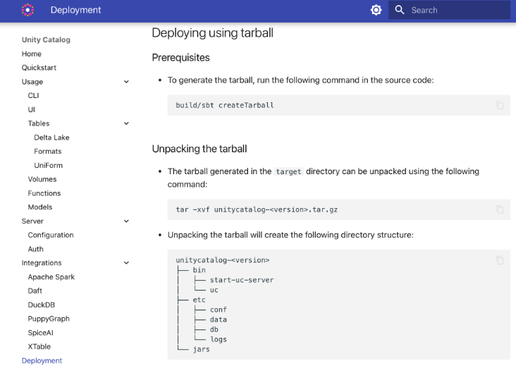
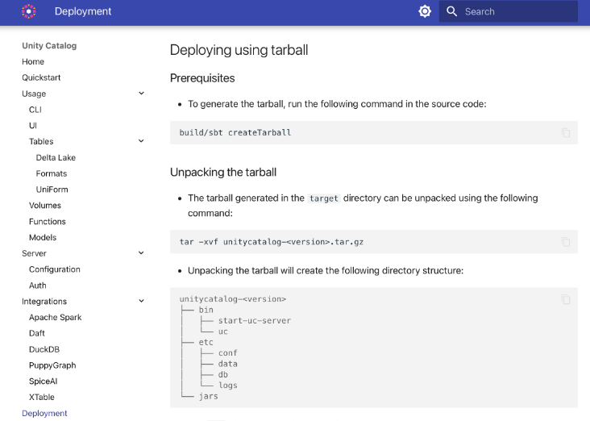

# Documentation for Unity Catalog

Unity Catalog uses [**MkDocs**](https://www.mkdocs.org/) to manage and serve its documentation. MkDocs is a simple, static site generator that’s geared towards project documentation and is written in Python.

This guide will help you set up the local environment, serve the documentation locally, and deploy it to GitHub Pages.

## Setting Up MkDocs for Local Development

To start testing or modifying the documentation locally, follow these steps:

### 1. Install MkDocs

While you may install **MkDocs** directly using `pip`, it is recommended to install it along with other dependencies via the `requirements-docs.txt` file in step 3.
This ensures that all necessary dependencies are handled together, especially when working in a virtual environment.

If you prefer to use pipx, you can install MkDocs globally with the following command:

```sh
pipx install mkdocs
```

### 2. Clone the Repository

Clone the Unity Catalog repository:

```sh
git clone https://github.com/unitycatalog/unitycatalog.git
```

After cloning, navigate to the top-level directory of the repository. There is no need to switch into the docs directory, as the `requirements-docs.txt` file is located in the top-level directory.

### 3. Install the Required Dependencies

The `requirements-docs.txt` file contains all the dependencies necessary for serving the documentation, including **MkDocs** and its plugins. First, create a virtual environment:

```sh
# Create virtual environment
python -m venv uc_docs_venv

# Activate virtual environment (Linux/macOS)
source uc_docs_venv/bin/activate

# Activate virtual environment (Windows)
uc_docs_venv/Scripts/activate
```

Next, install the following dependencies into your activated virtual environment:

```sh
pip install -r requirements-docs.txt
```

### 4. Serving the Docs Locally

After installing all dependencies, you can now serve the documentation locally. Run the following command:

```sh
mkdocs serve
```

This will start a local development server. By default, the docs will be served at `http://127.0.0.1:8000/`. You can visit this link in your browser to see your documentation live as you edit it. Any changes made to the markdown files will automatically update the browser view.

### 5. Modifying the Documentation

You can make changes to the documentation by editing the markdown files under the `docs` directory. MkDocs will watch for changes and automatically refresh your browser.

- **Structure of the documentation** is controlled by the `mkdocs.yml` file located at the root of the repository. This file defines the site structure, theme, and various configurations.
- **Adding new pages**: Add new markdown files to the `docs` folder and then update the `mkdocs.yml` file to include the new pages in the navigation.

> Note when **adding new a Integrations page**: Please include a reference to the new page in the `integrations/index.md` overview file to make it easier for users to find your integration from linked tutorials and blogs.

### 6. Testing Locally

After making changes to the documentation, be sure to view the changes at `http://127.0.0.1:8000/` to verify that everything looks and functions as expected.

---

## Deploying the Documentation

After you're satisfied with the changes, please deploy the documentation to your own repo's GitHub Pages. Please include a link to this deployment for any docs PRs, as this will help streamline reviews.

### 1. Ensure GitHub Pages is Enabled

Make sure GitHub Pages is enabled in your repository settings. To do this, go to your repository's **Settings** and scroll down to the **GitHub Pages** section. Choose the `gh-pages` branch as the source.

### 2. Deploy the Docs with MkDocs

MkDocs can automatically deploy the site to the `gh-pages` branch of your repository. To do so, simply run:

```sh
mkdocs gh-deploy
```

This command will build the documentation and push the generated files to the `gh-pages` branch. Once the command is finished, your documentation will be live on GitHub Pages at:

```console
https://<your-github-username>.github.io/unitycatalog
```

For example, if your GitHub username is `bobbiedraper`, your documentation will be available at:

```console
https://bobbiedraper.github.io/unitycatalog
```

### 3. Updating Documentation

Each time you make updates to the documentation, you can run the `mkdocs gh-deploy` command to push the latest changes to GitHub Pages.

---

## Additional Resources

For more detailed instructions on using MkDocs, check out the official MkDocs documentation:

- [MkDocs Documentation](https://www.mkdocs.org/)
- [Deploying MkDocs to GitHub Pages](https://www.mkdocs.org/user-guide/deploying-your-docs/#github-pages)

## Guidelines for Markdown formatting

This section mentions guidelines to follow for a proper formatting of Markdown in our documentation.

As general guideline we are using [markdownlint](https://github.com/DavidAnson/markdownlint) to ensure a common
formatting of Markdown files. Due to the usage of [MkDocs](https://www.mkdocs.org/) we define a custom definition of
rules. The definition is done in the `.markdownlint.yaml` file in the repository root directory. The reasoning of
specific configuration for rules is also documented there.

markdownlint can be executed locally by installing it directly or run it via `npx`, as shown below

```sh
npx markdownlint-cli docs/README.md
```

### Formatting code snippets within a list

If code snippets are present within a list, they should be aligned with the content of the list. The following section
shows an example of a proper formatting:

- The tarball generated in the `target` directory can be unpacked using the following command:

    ```sh
    tar -xvf unitycatalog-<version>.tar.gz
    ```

- Unpacking the tarball will create the following directory structure:

    ```console
    unitycatalog-<version>
    ├── bin
    │   ├── start-uc-server
    │   └── uc
    ├── etc
    │   ├── conf
    │   ├── data
    │   ├── db
    │   └── logs
    └── jars
    ```

Please note that this ensures that the code snippet is aligned with the text in the bullet points. The final result
should look similar to the following



In comparison an invalid alignment looks like this


