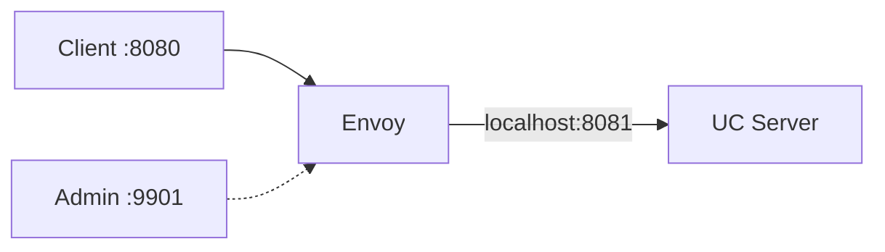

# All-in-One with Envoy Proxy

The all-in-one Docker image bundles [Envoy Proxy](https://www.envoyproxy.io/)
alongside the Unity Catalog server in a single container. Envoy handles external
traffic on port `8080` and proxies requests to the UC server on `localhost:8081`
inside the container.

This is useful for local development and for getting started quickly with
features such as OIDC authentication, rate limiting, and access logging that
Envoy can provide at the network layer without modifying the UC server itself.



!!! note "Production deployments"
    For production use, consider running Envoy and Unity Catalog as separate
    containers or services. The all-in-one image is designed for development
    convenience and as a starting point for Envoy configuration.

## Quick start

Pull or build the image, then run it:

```sh
docker run -p 8080:8080 -p 9901:9901 unitycatalog/unitycatalog:all-in-one
```

The catalog API is available at `http://localhost:8080` and the Envoy admin
interface at `http://localhost:9901`.

### Building from source

```sh
docker build --target all-in-one -t unitycatalog/unitycatalog:all-in-one .
```

## Configuration

The container supports two modes: **no-auth** (default) and **auth** (OIDC).
The mode is selected automatically based on whether the `OIDC_CLIENT_ID`
environment variable is set.

### No-auth mode

When no OIDC variables are set, Envoy acts as a plain reverse proxy using the
baseline config at `etc/envoy/envoy.yaml`. All requests are forwarded to the UC
server without authentication.

```sh
docker run -p 8080:8080 -p 9901:9901 \
  unitycatalog/unitycatalog:all-in-one
```

### Auth mode (OIDC)

Setting `OIDC_CLIENT_ID` activates auth mode. The entrypoint renders the
template at `etc/envoy/envoy.auth.yaml.tmpl` using `envsubst`, writes client and
HMAC secrets to temporary files, and starts Envoy with the rendered config.

Two Envoy HTTP filters are configured in the filter chain:

1. **JWT Authentication** (`jwt_authn`) -- validates `Authorization: Bearer`
   tokens against the provider's JWKS endpoint. Requests without a token are
   allowed through so the OAuth2 filter can handle them.
2. **OAuth2** -- redirects unauthenticated browser requests to the provider's
   authorization endpoint, exchanges authorization codes for tokens, and stores
   session state in signed cookies.

This means API clients that send a valid Bearer token are authenticated by the
JWT filter, while browser users without a token are redirected through the OAuth2
login flow.

#### Environment variables

| Variable | Required | Default | Description |
|---|---|---|---|
| `OIDC_PROVIDER_DOMAIN` | yes | | Hostname of the identity provider (used for TLS cluster routing) |
| `OIDC_AUTHORIZATION_ENDPOINT` | yes | | Full URL of the OAuth2 authorization endpoint |
| `OIDC_TOKEN_ENDPOINT` | yes | | Full URL of the OAuth2 token endpoint |
| `OIDC_JWKS_URI` | yes | | Full URL of the JWKS endpoint |
| `OIDC_ISSUER` | yes | | Expected `iss` claim in JWTs |
| `OIDC_CLIENT_ID` | yes | | OAuth2 client ID |
| `OIDC_CLIENT_SECRET` | yes | | OAuth2 client secret |
| `OIDC_HMAC_SECRET` | no | random | HMAC key for signing Envoy auth cookies. Auto-generated if not set. |
| `OIDC_SCOPES` | no | `openid profile email` | Space-separated OAuth2 scopes |
| `OIDC_CALLBACK_PATH` | no | `/callback` | Path the provider redirects to after login |

#### Provider examples

Example `.env` files are included for common identity providers. Copy one, fill
in your values, and pass it to `docker run`:

=== "Keycloak"

    ```sh
    docker run --env-file etc/envoy/examples/keycloak.env \
      -e OIDC_CLIENT_ID=unity-catalog \
      -e OIDC_CLIENT_SECRET=your-secret \
      -p 8080:8080 -p 9901:9901 \
      unitycatalog/unitycatalog:all-in-one
    ```

    Endpoints follow the pattern
    `https://<host>/realms/<realm>/protocol/openid-connect/*`.

=== "Azure Entra ID"

    ```sh
    docker run --env-file etc/envoy/examples/entra-id.env \
      -e OIDC_CLIENT_ID=your-app-client-id \
      -e OIDC_CLIENT_SECRET=your-secret \
      -p 8080:8080 -p 9901:9901 \
      unitycatalog/unitycatalog:all-in-one
    ```

    Endpoints follow the pattern
    `https://login.microsoftonline.com/<tenant>/oauth2/v2.0/*`.

=== "Okta"

    ```sh
    docker run --env-file etc/envoy/examples/okta.env \
      -e OIDC_CLIENT_ID=your-client-id \
      -e OIDC_CLIENT_SECRET=your-secret \
      -p 8080:8080 -p 9901:9901 \
      unitycatalog/unitycatalog:all-in-one
    ```

    Endpoints follow the pattern
    `https://<org-domain>/oauth2/default/v1/*`.

## Customization

### Mounting a custom Envoy config

To bypass the template system entirely, mount your own `envoy.yaml` and set the
`ENVOY_CONFIG` environment variable:

```sh
docker run \
  -v ./my-envoy.yaml:/opt/unitycatalog/etc/envoy/custom.yaml \
  -e ENVOY_CONFIG=/opt/unitycatalog/etc/envoy/custom.yaml \
  -p 8080:8080 -p 9901:9901 \
  unitycatalog/unitycatalog:all-in-one
```

As long as `OIDC_CLIENT_ID` is not set, the entrypoint uses the config pointed
to by `ENVOY_CONFIG` without any template rendering.

### Mounting UC server configuration

UC server configuration files can be bind-mounted the same way as with other
images:

```sh
docker run \
  -v ./etc/conf:/opt/unitycatalog/etc/conf \
  -p 8080:8080 -p 9901:9901 \
  unitycatalog/unitycatalog:all-in-one
```

### Docker Compose

A commented-out `all-in-one` service is included in `compose.yaml`. Uncomment it
to use the all-in-one image instead of the default server:

```yaml
all-in-one:
  build:
    context: .
    target: all-in-one
  ports:
    - "8080:8080"
    - "9901:9901"
  volumes:
    - type: bind
      source: ./etc/conf
      target: /opt/unitycatalog/etc/conf
    - type: bind
      source: ./etc/envoy
      target: /opt/unitycatalog/etc/envoy
    - type: volume
      source: unitycatalog_data
      target: /opt/unitycatalog/etc/data
```

To enable auth mode in Compose, add an `env_file` and override the secrets:

```yaml
all-in-one:
  # ...
  env_file: ./etc/envoy/examples/keycloak.env
  environment:
    OIDC_CLIENT_ID: unity-catalog
    OIDC_CLIENT_SECRET: your-secret
```

## Ports

| Port | Service | Description |
|---|---|---|
| `8080` | Envoy | External-facing HTTP port (proxies to UC) |
| `9901` | Envoy Admin | Admin interface for stats, clusters, and config dump |
| `8081` | UC Server | Internal only (localhost inside the container) |

## Envoy admin interface

The admin interface at `http://localhost:9901` is useful for debugging. Some
helpful endpoints:

| Path | Description |
|---|---|
| `/ready` | Readiness check |
| `/clusters` | Upstream cluster health and stats |
| `/config_dump` | Full rendered Envoy configuration |
| `/stats` | Envoy metrics |

## Architecture

The `all-in-one` Dockerfile target is based on the official
`envoyproxy/envoy:v1.32-latest` image. It copies in a glibc-compatible JDK
(Eclipse Temurin 17) and the UC distribution artifacts from the build stage.

The entrypoint script (`bin/start-all-in-one`) starts both processes and monitors
them:

- The UC server runs in the background on port `8081`.
- Envoy runs in the background with the selected configuration.
- A monitoring loop checks both processes and exits if either one dies.
- `SIGTERM` and `SIGINT` are trapped to shut down both processes cleanly.
