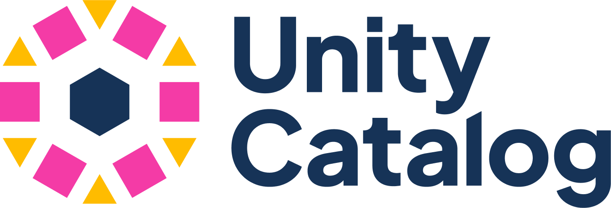
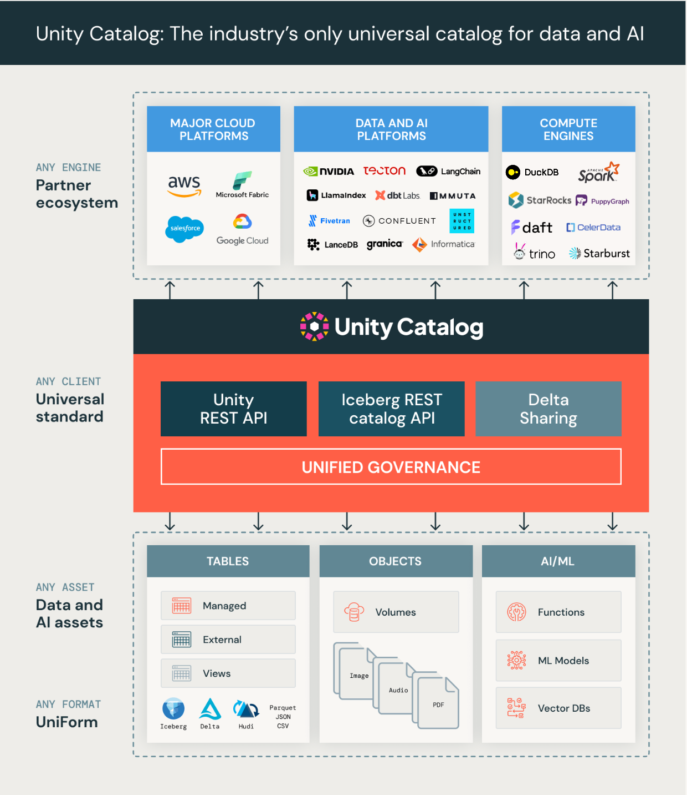

# Unity Catalog: Open, Multimodal Catalog for Data & AI

Unity Catalog is the industry’s only universal catalog for data and AI.

- **Multimodal interface supports any format, engine, and asset**
    - Multi-format support: It is extensible and supports Delta Lake, Apache Iceberg and Apache Hudi via UniForm,
        Apache Parquet, JSON, CSV, and many others.
    - Multi-engine support: Unity Catalog's open APIs allow many leading compute engines to read data cataloged in Unity.
    - Multimodal: It supports all your data and AI assets, including tables, files, functions, AI models.
- **Open source API and implementation** - OpenAPI spec and OSS implementation (Apache 2.0 license). It is also
    compatible with Apache Hive's metastore API and Apache Iceberg's REST catalog API. Unity Catalog is currently a
    sandbox project with LF AI and Data Foundation (part of the Linux Foundation).
- **Unified governance** for data and AI - Govern and secure tabular data, unstructured assets, and AI assets with a
    single interface.

The first release of Unity Catalog focuses on a core set of APIs for tables, unstructured data, and AI assets. More
will come soon on governance, access, and client interoperability. This is just the beginning!

## Project Governance

Unity Catalog is proud to be hosted by the [LF AI & Data Foundation](https://lfaidata.foundation/projects).

