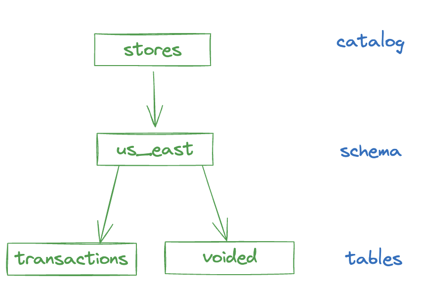
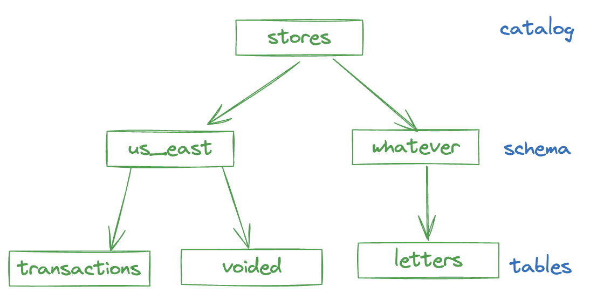
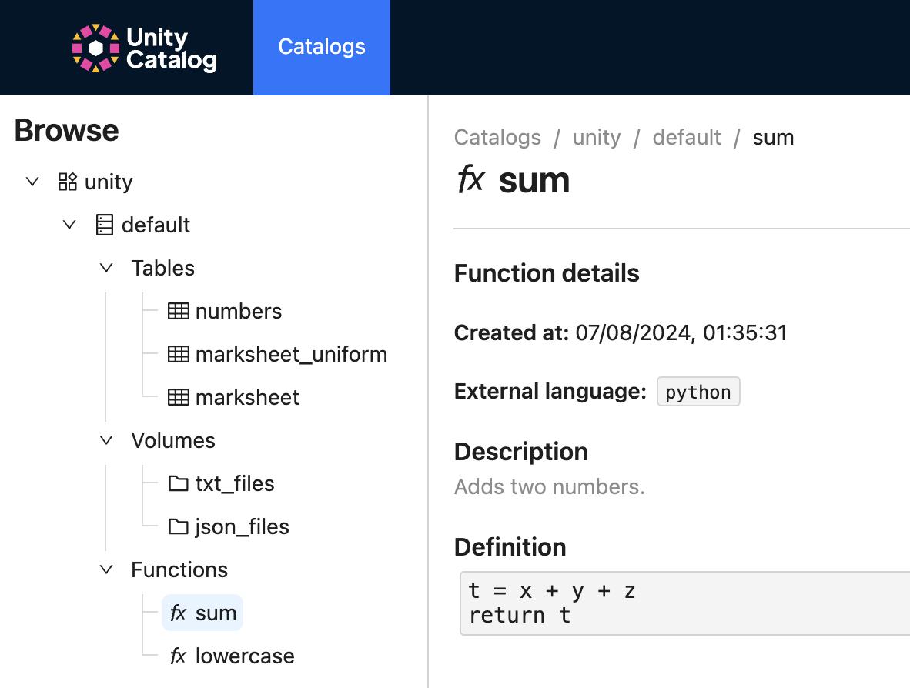

# Unity Catalog Apache Spark™ Integration

This page explains how to create Unity Catalog tables with Apache Spark™.

[Apache Spark](http://spark.apache.org) is a multi-language engine for executing data engineering, data science, and
machine learning on single-node machines or clusters.

Integrating Apache Spark with Unity Catalog offers significant advantages over traditional catalog solutions.
Unity Catalog provides unified governance across both data and AI assets, fine-grained access control down to the
column level, automated data lineage tracking, and seamless interoperability with various lakehouse formats and
compute engines. It enables centralized metadata management, simplified data discovery, and enhanced security. The
credential vending capability of Unity Catalog is particularly noteworthy as it allows Apache Spark to securely access
data stored in Unity Catalog through a controlled mechanism.

- Neatly organizing data in tables and volumes in the Unity Catalog hierarchy makes it a lot easier to write Spark code.
- Make it easier to decouple business logic from file paths.
- Provides easy access to different file formats without end users needing to know how the data is stored.

!!! warning "Prerequisites"
    For Apache Spark and Delta Lake to work together with Unity Catalog, you will need atleast Apache Spark 3.5.3 and
    Delta Lake 3.2.1.

## Download and Configure Unity Catalog for Apache Spark

The following steps are required to download and configure Unity Catalog for Apache Spark.

### Download Apache Spark

[Download](https://spark.apache.org/downloads.html) the latest version of Apache Spark >= 3.5.3 or using the following
command.

```sh title="Download Apache Spark 3.5.3 using curl"
curl -O https://archive.apache.org/dist/spark/spark-3.5.3/spark-3.5.3-bin-hadoop3.tgz
tar xzf spark-3.5.3-bin-hadoop3.tgz
```

### [Optional] Configure server properties for cloud storage

To have Unity Catalog work with cloud object storage as the storage location for tables, configure the
`etc/conf/server.properties` to add configuration:

=== "AWS S3"

    ```sh
    ## S3 Storage Config (Multiple configs can be added by incrementing the index)
    s3.bucketPath.0=<S3_BUCKET>
    s3.region.0=<S3_REGION>
    s3.awsRoleArn.0=<S3_ROLE>
    # Optional (If blank, it will use DefaultCredentialsProviderChain)
    s3.accessKey.0=<SECRET>
    s3.secretKey.0=<SECRET>
    ```

=== "Azure ADLSgen2"

    ```sh
    ## ADLS Storage Config (Multiple configs can be added by incrementing the index)
    adls.storageAccountName.0=<ADLS_STORAGEACCOUNTNAME>
    adls.tenantId.0=<ADLS_TENANTID>
    adls.clientId.0=<ADLS_CLIENTID>
    adls.clientSecret.0=<SECRET>
    ```

=== "Google Cloud Storage"

    ```sh
    ## GCS Storage Config (Multiple configs can be added by incrementing the index)
    gcs.bucketPath.0=<GCS_BUCKET>
    # Optional (If blank, it will use Default Application chain to find credentials)
    gcs.jsonKeyFilePath.0=/path/to/<SECRET>/gcp-key-uc-testing.json
    ```

### [Optional] Restart Unity Catalog Server

If the UC Server is already started, please restart it to account for the cloud storage server properties.

```sh
cd unitycatalog/
bin/start-uc-server
```

## Working with Unity Catalog Tables with Apache Spark and Delta Lake Locally

Let’s start running some Spark SQL queries in the Spark SQL shell (`bin/spark-sql`) or PySpark shell (`bin/pyspark`)
within the terminal of your Apache Spark 3.5.3 folder against your local UC.

You can run the code below to work with data stored in the `unity` catalog that comes pre-loaded with the local Unity Catalog server.

!!! warning "Catalog name in configs"

    If you want to work with data stored in another catalog, make sure to change `unity` in the Spark configs to `<your_catalog_name>`, e.g. `spark.sql.catalog.<your_catalog_name>`.

=== "Spark SQL"

    ```sh
    bin/spark-sql --name "local-uc-test" \
        --master "local[*]" \
        --packages "io.delta:delta-spark_2.12:3.2.1,io.unitycatalog:unitycatalog-spark_2.12:0.2.0" \
        --conf "spark.sql.extensions=io.delta.sql.DeltaSparkSessionExtension" \
        --conf "spark.sql.catalog.spark_catalog=io.unitycatalog.spark.UCSingleCatalog" \
        --conf "spark.sql.catalog.<catalog_name>=io.unitycatalog.spark.UCSingleCatalog" \
        --conf "spark.sql.catalog.<catalog_name>.uri=http://localhost:8080" \
        --conf "spark.sql.catalog.<catalog_name>.token=" \
        --conf "spark.sql.defaultCatalog=<catalog_name>"
    ```

=== "PySpark"

    ```sh
    bin/pyspark --name "local-uc-test" \
        --master "local[*]" \
        --packages "io.delta:delta-spark_2.12:3.2.1,io.unitycatalog:unitycatalog-spark_2.12:0.2.0" \
        --conf "spark.sql.extensions=io.delta.sql.DeltaSparkSessionExtension" \
        --conf "spark.sql.catalog.spark_catalog=io.unitycatalog.spark.UCSingleCatalog" \
        --conf "spark.sql.catalog.<catalog_name>=io.unitycatalog.spark.UCSingleCatalog" \
        --conf "spark.sql.catalog.<catalog_name>.uri=http://localhost:8080" \
        --conf "spark.sql.catalog.<catalog_name>.token=" \
        --conf "spark.sql.defaultCatalog=<catalog_name>"
    ```

!!! tip "Tip"
    Initially, this may take a few minutes to run to download the necessary dependencies. Afterwards, you can run some
    quick commands to see your UC assets within Spark SQL shell.

Notice the following packages (`--packages`) and configurations (`--conf`)

- `--packages` points to the delta-spark and unitycatalog-spark packages; update the version numbers to your current versions.
- `spark.sql.catalog.<catalog_name>.uri` points to your local development UC instance
- `spark.sql.catalog.<catalog_name>.token` is empty indicating there is no authentication; refer to [auth](../server/auth.md) for more information.
- `spark.sql.defaultCatalog=<catalog_name>` must be filled out to indicate the default catalog. The default name is `unity`.

??? note "Three-part and two-part naming conventions"

    

    As noted in [Unity Catalog 101](https://www.unitycatalog.io/blogs/unity-catalog-oss), UC has a three-part naming
    convention of [`catalog`].[`schema`].[`asset`]. In the following examples, you can use the three-part notation such
    as `SELECT * FROM unity.default.marksheet;` or the two-part notation `SELECT * FROM default.marksheet;` as the
    `defaultCatalog` is already configured.

### [Optional] Running Spark SQL for Cloud Object Stores

If you would like to run this against cloud object storage, the following versions of the `bin/spark-sql` shell
command.

=== "AWS S3"

    ```sh
    bin/spark-sql --name "s3-uc-test" \
        --master "local[*]" \
        --packages "org.apache.hadoop:hadoop-aws:3.3.4,io.delta:delta-spark_2.12:3.2.1,io.unitycatalog:unitycatalog-spark_2.12:0.2.0" \
        --conf "spark.sql.extensions=io.delta.sql.DeltaSparkSessionExtension" \
        --conf "spark.sql.catalog.spark_catalog=io.unitycatalog.spark.UCSingleCatalog" \
        --conf "spark.hadoop.fs.s3.impl=org.apache.hadoop.fs.s3a.S3AFileSystem" \
        --conf "spark.sql.catalog.<catalog_name>=io.unitycatalog.spark.UCSingleCatalog" \
        --conf "spark.sql.catalog.<catalog_name>.uri=http://localhost:8080" \
        --conf "spark.sql.catalog.<catalog_name>.token=" \
        --conf "spark.sql.defaultCatalog=<catalog_name>"
    ```

=== "Azure ADLSgen2"

    ```sh
    bin/spark-sql --name "azure-uc-test" \
        --master "local[*]" \
        --packages "org.apache.hadoop:hadoop-azure:3.3.6,io.delta:delta-spark_2.12:3.2.1,io.unitycatalog:unitycatalog-spark_2.12:0.2.0" \
        --conf "spark.sql.extensions=io.delta.sql.DeltaSparkSessionExtension" \
        --conf "spark.sql.catalog.spark_catalog=io.unitycatalog.spark.UCSingleCatalog" \
        --conf "spark.sql.catalog.<catalog_name>=io.unitycatalog.spark.UCSingleCatalog" \
        --conf "spark.sql.catalog.<catalog_name>.uri=http://localhost:8080" \
        --conf "spark.sql.catalog.<catalog_name>.token=" \
        --conf "spark.sql.defaultCatalog=<catalog_name>"
    ```

=== "Google Cloud Storage"

    ```sh
    bin/spark-sql --name "gcs-uc-test" \
        --master "local[*]" \
        --jars "https://repo1.maven.org/maven2/com/google/cloud/bigdataoss/gcs-connector/3.0.2/gcs-connector-3.0.2-shaded.jar" \
        --packages "io.delta:delta-spark_2.12:3.2.1,io.unitycatalog:unitycatalog-spark_2.12:0.2.0" \
        --conf "spark.sql.extensions=io.delta.sql.DeltaSparkSessionExtension" \
        --conf "spark.sql.catalog.spark_catalog=io.unitycatalog.spark.UCSingleCatalog" \
        --conf "spark.hadoop.fs.gs.impl=com.google.cloud.hadoop.fs.gcs.GoogleHadoopFileSystem" \
        --conf "spark.hadoop.fs.AbstractFileSystem.gs.impl=com.google.cloud.hadoop.fs.gcs.GoogleHadoopFS" \
        --conf "spark.sql.catalog.<catalog_name>=io.unitycatalog.spark.UCSingleCatalog" \
        --conf "spark.sql.catalog.<catalog_name>.uri=http://localhost:8080" \
        --conf "spark.sql.catalog.<catalog_name>.token=" \
        --conf "spark.sql.defaultCatalog=<catalog_name>"
    ```

## Using Spark SQL to query Unity Catalog schemas and tables

Let’s start by running some quick commands from the Spark SQL and pyspark shells.

The following `SHOW SCHEMA` shows the `default` schema that is included in the initial UC configuration.

=== "Spark SQL"

    ```sql
    -- Show schemas (output = default)
    SHOW SCHEMAS;

    -- Show tables
    SHOW TABLES IN default;
    ```

=== "PySpark"

    ```python
    # Show schemas (output = default)
    spark.sql("SHOW SCHEMAS").show()

    # Show tables
    spark.sql("SHOW TABLES IN default").show()
    ```

with the output similar to:

```console
+---------+-----------------+-----------+
|namespace|        tableName|isTemporary|
+---------+-----------------+-----------+
|  default|        marksheet|      false|
|  default|marksheet_uniform|      false|
|  default|          numbers|      false|
|  default|   user_countries|      false|
+---------+-----------------+-----------+
```

Let’s query the first five rows of the `marksheet` table.

=== "Spark SQL"

    ```sql
    SELECT * FROM default.marksheet LIMIT 5;
    ```

=== "PySpark"

    ```python
    spark.sql("SELECT * FROM default.marksheet LIMIT 5;").show()
    ```

With the output looking similar to the following.

```console
+---+----------+-----+
| id|      name|marks|
+---+----------+-----+
|  1|nWYHawtqUw|  930|
|  2|uvOzzthsLV|  166|
|  3|WIAehuXWkv|  170|
|  4|wYCSvnJKTo|  709|
|  5|VsslXsUIDZ|  993|
+---+----------+-----+
```

## Running CRUD Operations on a Unity Catalog Table

Let’s extend this example by executing various CRUD operations on our UC tables.

### Create New Schema

=== "Spark SQL"

    ```sql
    -- Create new schema
    CREATE SCHEMA demo;

    -- Should now show two schemas: default and demo
    SHOW SCHEMAS;
    ```

=== "PySpark"

    ```python
    # Create new schema
    spark.sql("CREATE SCHEMA demo")

    # Should now show two schemas: default and demo
    spark.sql("SHOW SCHEMAS").show()
    ```

### Create New Table

=== "Spark SQL"

    ```sql
    -- Create a new table
    CREATE TABLE demo.mytable (id INT, desc STRING)
    USING delta
    LOCATION '<LOCATION>';
    -- Example location:
    -- LOCATION '/tmp/tables/mytable';
    ```

=== "PySpark"

    ```python
    # Create a new table
    spark.sql("""
    CREATE TABLE demo.mytable (id INT, desc STRING)
    USING delta
    LOCATION '<LOCATION>'
    """)
    # Example location:
    # LOCATION '/tmp/tables/mytable'
    ```

### Insert New Rows into Table

=== "Spark SQL"

    ```sql
    -- Insert new rows
    INSERT INTO demo.mytable VALUES (1, "test 1");
    INSERT INTO demo.mytable VALUES (2, "test 2");
    INSERT INTO demo.mytable VALUES (3, "test 3");
    INSERT INTO demo.mytable VALUES (4, "test 4");

    -- Read table
    SELECT * FROM demo.mytable;
    ```

=== "PySpark"

    ```python
    # Insert new rows
    spark.sql("INSERT INTO demo.mytable VALUES (1, 'test 1')")
    spark.sql("INSERT INTO demo.mytable VALUES (2, 'test 2')")
    spark.sql("INSERT INTO demo.mytable VALUES (3, 'test 3')")
    spark.sql("INSERT INTO demo.mytable VALUES (4, 'test 4')")

    # Read table
    spark.sql("SELECT * FROM demo.mytable").show()
    ```

### Update Row in Table

=== "Spark SQL"

    ```sql
    -- Update row in table
    UPDATE demo.mytable SET id = 5 WHERE id = 4;
    ```

=== "PySpark"

    ```python
    # Update row in table
    spark.sql("UPDATE demo.mytable SET id = 5 WHERE id = 4")
    ```

### Delete Row from Table

=== "Spark SQL"

    ```sql
    -- Delete rows
    DELETE FROM demo.mytable WHERE id = 5;
    ```

=== "PySpark"

    ```python
    # Delete rows
    spark.sql("DELETE FROM demo.mytable WHERE id = 5")
    ```

### Merge `mytable` with `srctable`

Create Secondary Table

=== "Spark SQL"

    ```sql
    -- Create secondary table (we will use this as the source for merge)
    CREATE TABLE demo.srctable (id INT, desc STRING)
    USING delta
    LOCATION '<LOCATION>';
    -- Example location:
    -- LOCATION '/tmp/tables/srctable';

    -- Insert new rows
    INSERT INTO demo.srctable VALUES (3, "updated");
    INSERT INTO demo.srctable VALUES (4, "inserted");
    ```

=== "PySpark"

    ```python
    # Create secondary table (we will use this as the source for merge)
    spark.sql("""
    CREATE TABLE demo.srctable (id INT, desc STRING)
    USING delta
    LOCATION '<LOCATION>'
    """)
    # Example location:
    # LOCATION '/tmp/tables/srctable';

    # Insert new rows
    spark.sql("INSERT INTO demo.srctable VALUES (3, 'updated')")
    spark.sql("INSERT INTO demo.srctable VALUES (4, 'inserted')")
    ```

Merge Command

=== "Spark SQL"

    ```sql
    -- Merge
    MERGE INTO demo.mytable as target
    USING demo.srctable as source
        ON target.id = source.id
    WHEN MATCHED THEN
        UPDATE SET *
    WHEN NOT MATCHED THEN
        INSERT *
    ;

    -- Check results
    SELECT * FROM demo.mytable;
    ```

=== "PySpark"

    ```python
    # Merge
    spark.sql("""
    MERGE INTO demo.mytable AS target
    USING demo.srctable AS source
        ON target.id = source.id
    WHEN MATCHED THEN
        UPDATE SET *
    WHEN NOT MATCHED THEN
        INSERT *
    """)

    # Check results
    spark.sql("SELECT * FROM demo.mytable").show()
    ```

```console title="Merged Results"
3       updated
4       inserted
1       test 1
2       test 2
```

Drop Table

=== "Spark SQL"

    ```sql

    -- Drop tables
    DROP TABLE demo.srctable;

    -- Check results
    SHOW TABLES IN default;
    ```

=== "PySpark"

    ```python
    # Drop tables
    spark.sql("DROP TABLE demo.srctable")

    # Check results
    spark.sql("SHOW TABLES IN default").show()
    ```

!!! warning
    Note, this action will only drop the table from UC, it will not remove the data from the file system

<!--
## Benefits of using Unity Catalog for Spark

> Rather the major reasons to focus on are
> - credential vending - no more need to configure a single set of s3/azure/gcs creds for all your tables in your spark app. UC will automatically provide creds for each table in each query.
> - governance and access control - admins can centrally control who has access to which tables

-->

<!--

## Create a managed Unity Catalog table with Spark

Let’s create a managed Unity Catalog table with Spark.

```python
df = spark.createDataFrame([
    (1, "socks"),
    (2, "chips"),
    (3, "air conditioner"),
    (4, "tea"),
], ["transaction_id", "item_name"])

df.write.format("parquet").saveAsTable("stores.us_east.transactions")
```

This table uses the three-level Unity Catalog namespacing: `catalog_name.schema_name.table_name`.

Confirm that we’re able to read the table:

```
spark.table("stores.us_east.transactions").show()
+--------------+---------------+
|transaction_id|      item_name|
+--------------+---------------+
|             1|          socks|
|             2|          chips|
|             3|air conditioner|
|             4|            tea|
+--------------+---------------+
```

Now, let’s create another managed table:

```python
voided = spark.createDataFrame([(1,), (4,)], ["transaction_id"])

voided.write.format("parquet").saveAsTable("stores.us_east.voided")
```

> we need to cover both parquet and delta

Here’s a visualization of the tables.



Suppose the transactions table represents all the transactions, and the voided table contains the transactions that were subsequently canceled.  Compute all the non-voided transactions.

```python
transactions = spark.table("stores.us_east.transactions")
voided = spark.table("stores.us_east.voided")

transactions.join(
    voided,
    transactions.transaction_id == voided.transaction_id,
    "leftanti"
).show()
```

```
+--------------+---------------+
|transaction_id|      item_name|
+--------------+---------------+
|             2|          chips|
|             3|air conditioner|
+--------------+---------------+
```

Now, let’s look at how to create external Unity Catalog tables.

## Create an external Unity Catalog table with Spark

Here’s how to create an external Unity Catalog table with Spark:

```python
letters = spark.createDataFrame([
    (1, "a"),
    (2, "b"),
    (3, "c"),
], ["id", "letter"])

letters.write.format("parquet").saveAsTable("stores.whatever.letters", path="/tmp/letters")
```

When you manually specify the path, as in the example above, Spark creates an unmanaged table.

Let’s look at a visualization of our current tables:



See this page to learn more about the difference between external and managed Unity Catalog tables.

## Spark write data to path

> this section does not seem useful to UC. its not a general spark guide.. but spark uc integration guide

You can also use Spark to write data to a path and not make any Unity Catalog entries.

```python
people = spark.createDataFrame([
    (1, "li"),
    (2, "chung"),
], ["id", "first_name"])

people.write.format("parquet").save("/tmp/people")
```

As you can see in the example above, writing data with Spark doesn’t necessarily create a new entry in the Unity Catalog. This writes data to a path but doesn’t create any associated entries in the Unity Catalog, burdening the user with managing the credentials and access to the data themselves.

## Advantage of Unity Catalog for Spark

Unity Catalog has many advantages for Spark users.

**Decoupling data storage location from business logic**

> these reasons can be improved quite a bit.
> - Decoupling data storage location from business logic
>   - thats general reason for using any catalog including HMS. not specific to UC.
> - Making it easier to organize and find datasets
>   - does not quite help users who just want to use tables. this would be great once we have other assets within the UC spark integration, but we are not there yet.

You don’t want to hardcode file paths in your code because then the location of your data becomes coupled with your business logic.  Here’s an example of bad code:

```python
people = spark.read.format("parquet").load("/tmp/people")
...
```

This code would break if the location of the underlying data ever changes.

```python
people = spark.table("stores.us_east.people")
```

This allows for the underlying table to be moved without breaking the business logic.

**Making it easier to organize and find datasets**

When datasets are registered in Unity Catalog, you can use the CLI or UI to easily find all the data assets.  Let’s take a look at the Unity Catalog UI:



We can easily see the schemas, tables, volumes, and functions that are registered in Unity Catalog!

**Allows for ergonomic implementations of common design patterns, like the Medallion architecture**

The Medallion architecture is a conceptual data organization framework that’s sometimes useful when building ETL pipelines, as described in [this blog post](https://delta.io/blog/delta-lake-medallion-architecture/).

Unity Catalog is a great way to organize data assets for pipelines that use the Medallion architecture.  You can create bronze, silzer, and gold schemas to clearly bucket the different data assets.

**Flexibility to use managed or external tables**

It’s easy to make either external or managed Unity Catalog tables with Spark.

If you want to manage the path yourself, you can use external tables.

If you want Unity Catalog to manage the paths, you can use managed tables.

In either case, Unity Catalog still allows for the decoupling of business logic and the underlying storage paths.

**Easy access to different types of data assets and file formats**

When you’re reading data from paths, you need to understand the underlying data storage format.  Here are a couple of examples:

```python
people = spark.read.format("parquet").load("/tmp/people")
countries = spark.read.format("csv").load("/tmp/countries")
```

Your business logic needs to know that the people dataset is stored in Parquet files and the countries dataset is stored in CSV files.

Unity Catalog provides a much better user experience because you don’t need to know how the underlying data is stored and can write code like this:

```python
people = spark.table("customers.us_east.people")
countries = spark.table("users.demographics.countries")
```
-->
