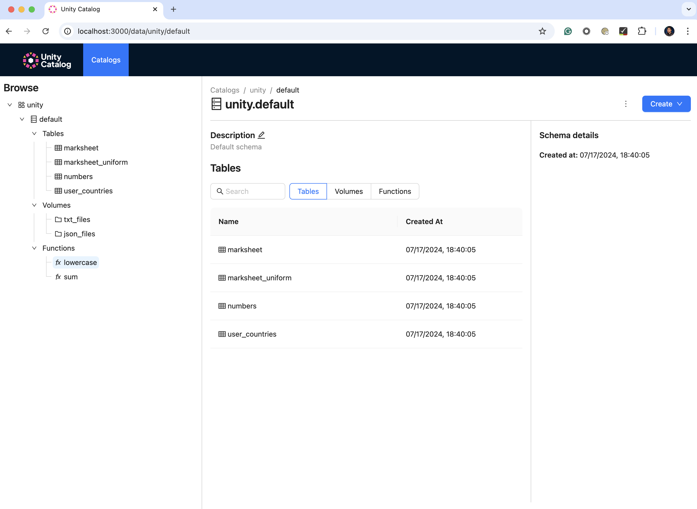

# Quickstart

This quickstart shows how to run Unity Catalog on localhost which is great for experimentation and testing.

## How to start the Unity Catalog server

Start by cloning the open source Unity Catalog GitHub repository:

```sh
git clone git@github.com:unitycatalog/unitycatalog.git
```

> To start Unity Catalog in Docker, refer to the [Docker
> Compose docs](docker_compose.md).

To run Unity Catalog, you need **Java 17** installed on your machine.  You can
always run the `java --version` command to verify that you have the right
version of Java installed such as the following example output.

```sh
% java --version
openjdk 17.0.12 2024-07-16
OpenJDK Runtime Environment Homebrew (build 17.0.12+0)
OpenJDK 64-Bit Server VM Homebrew (build 17.0.12+0, mixed mode, sharing)
```

Change into the `unitycatalog` directory and run `bin/start-uc-server` to instantiate the server. Here is what you
should see:

```console
################################################################### 
#  _    _       _ _            _____      _        _              #
# | |  | |     (_) |          / ____|    | |      | |             #
# | |  | |_ __  _| |_ _   _  | |     __ _| |_ __ _| | ___   __ _  #
# | |  | | '_ \| | __| | | | | |    / _` | __/ _` | |/ _ \ / _` | #
# | |__| | | | | | |_| |_| | | |___| (_| | || (_| | | (_) | (_| | #
#  \____/|_| |_|_|\__|\__, |  \_____\__,_|\__\__,_|_|\___/ \__, | #
#                      __/ |                                __/ | #
#                     |___/               v0.2.0           |___/  #
###################################################################
```

Well, that was pretty easy!

## Verify Unity Catalog server is running

Let’s create a new Terminal window and verify that the Unity Catalog server is running.

Unity Catalog has a few built-in tables that are great for quick experimentation. Let’s look at all the tables that
have a catalog name of “unity” and a schema name of “default” with the Unity Catalog CLI.

```sh
bin/uc table list --catalog unity --schema default
```

```console
┌─────────────────┬──────────────┬─────┬────────────────────────────────────┐
│      NAME       │ CATALOG_NAME │ ... │              TABLE_ID              │
├─────────────────┼──────────────┼─────┼────────────────────────────────────┤
│marksheet        │unity         │ ... │c389adfa-5c8f-497b-8f70-26c2cca4976d│
├─────────────────┼──────────────┼─────┼────────────────────────────────────┤
│marksheet_uniform│unity         │ ... │9a73eb46-adf0-4457-9bd8-9ab491865e0d│
├─────────────────┼──────────────┼─────┼────────────────────────────────────┤
│numbers          │unity         │ ... │32025924-be53-4d67-ac39-501a86046c01│
├─────────────────┼──────────────┼─────┼────────────────────────────────────┤
│user_countries   │unity         │ ... │26ed93b5-9a18-4726-8ae8-c89dfcfea069│
└─────────────────┴──────────────┴─────┴────────────────────────────────────┘
```

Let’s read the content of the `unity.default.numbers` table with the Unity Catalog CLI.

```sh
bin/uc table read --full_name unity.default.numbers
```

```console
┌───────────────────┬────────────────────┐
│as_int(integer)    │as_double(double)   │
├───────────────────┼────────────────────┤
│564                │188.75535598441473  │
├───────────────────┼────────────────────┤
│755                │883.6105633023361   │
├───────────────────┼────────────────────┤
│...                │...                 │
├───────────────────┼────────────────────┤
│958                │509.3712727285101   │
└───────────────────┴────────────────────┘
```

We can see it’s straightforward to make queries with the Unity Catalog CLI.

## Unity Catalog structure

Unity Catalog stores all assets in a 3-level namespace:

1. catalog
2. schema
3. assets like tables, volumes, functions, etc.


Here's an example Unity Catalog instance:


This Unity Catalog instance contains a single catalog named `cool_stuff`.

The `cool_stuff` catalog contains two schema: `thing_a` and `thing_b`.

`thing_a` contains a Delta table, a function, and a Lance volume. `thing_b` contains two Delta tables.

Unity Catalog provides a nice organizational structure for various datasets.

## List the catalogs and schemas with the CLI

The Unity Catalog server is pre-populated with a few sample catalogs, schemas, Delta tables, etc.

Let's start by listing the catalogs using the CLI.

```sh
bin/uc catalog list
```

You should see a catalog named `unity`. Let's see what's in this `unity` catalog (pun intended).

```sh
bin/uc schema list --catalog unity
```

```console
┌───────┬────────────┬───┬────────────────────────────────────┐
│ NAME  │CATALOG_NAME│...│             SCHEMA_ID              │
├───────┼────────────┼───┼────────────────────────────────────┤
│default│unity       │...│b08dfd57-a939-46cf-b102-9b906b884fae│
└───────┴────────────┴───┴────────────────────────────────────┘
```

You should see that there is a schema named `default`. To go deeper into the contents of this schema,
you have to list different asset types separately. Let's start with tables.

## Operate on Delta tables with the CLI

Let's list the tables.

```sh
bin/uc table list --catalog unity --schema default
```

```console
┌─────────────────┬────────────┬────┬────────────────────────────────────┐
│      NAME       │CATALOG_NAME│....│              TABLE_ID              │
├─────────────────┼────────────┼────┼────────────────────────────────────┤
│marksheet        │unity       │....│c389adfa-5c8f-497b-8f70-26c2cca4976d│
├─────────────────┼────────────┼────┼────────────────────────────────────┤
│marksheet_uniform│unity       │....│9a73eb46-adf0-4457-9bd8-9ab491865e0d│
├─────────────────┼────────────┼────┼────────────────────────────────────┤
│numbers          │unity       │....│32025924-be53-4d67-ac39-501a86046c01│
├─────────────────┼────────────┼────┼────────────────────────────────────┤
│user_countries   │unity       │....│26ed93b5-9a18-4726-8ae8-c89dfcfea069│
└─────────────────┴────────────┴────┴────────────────────────────────────┘
```

You should see a few tables. Some details are truncated because of the nested nature of the data.

> To see all the content, you can add `--output jsonPretty` to any command.

Next, let's get the metadata of one those tables.

```sh
bin/uc table get --full_name unity.default.numbers
```

```console
┌──────────────────────┬───────────────────────────────────────────┐
│         KEY          │                  VALUE                    │
├──────────────────────┼───────────────────────────────────────────┤
│NAME                  │numbers                                    │
├──────────────────────┼───────────────────────────────────────────┤
│CATALOG_NAME          │unity                                      │
├──────────────────────┼───────────────────────────────────────────┤
│SCHEMA_NAME           │default                                    │
├──────────────────────┼───────────────────────────────────────────┤
│TABLE_TYPE            │EXTERNAL                                   │
├──────────────────────┼───────────────────────────────────────────┤
│DATA_SOURCE_FORMAT    │DELTA                                      │
├──────────────────────┼───────────────────────────────────────────┤
│COLUMNS               │{"name":"as_int","type_text":"int","type_js│
│                      │NT","type_precision":0,"type_scale":0,"type│
│                      │{"name":"as_double","type_text":"double","t│
│                      │name":"DOUBLE","type_precision":0,"type_sca│
│                      │column","nullable":false,"partition_index":│
├──────────────────────┼───────────────────────────────────────────┤
│...                   │...                                        │
├──────────────────────┼───────────────────────────────────────────┤
│TABLE_ID              │32025924-be53-4d67-ac39-501a86046c01       │
└──────────────────────┴───────────────────────────────────────────┘
```

You can see this is a Delta table from the `DATA_SOURCE_FORMAT` metadata.

Here's how to print a snippet of a Delta table (powered by the [Delta Kernel Java](https://delta.io/blog/delta-kernel/) project).

Let's try creating a new table.

```sh
bin/uc table create --full_name unity.default.mytable \
--columns "col1 int, col2 double" --storage_location /tmp/uc/my_table
```

```console
┌──────────────────────┬───────────────────────────────────────────┐
│         KEY          │                  VALUE                    │
├──────────────────────┼───────────────────────────────────────────┤
│NAME                  │mytable                                    │
├──────────────────────┼───────────────────────────────────────────┤
│CATALOG_NAME          │unity                                      │
├──────────────────────┼───────────────────────────────────────────┤
│SCHEMA_NAME           │default                                    │
├──────────────────────┼───────────────────────────────────────────┤
│TABLE_TYPE            │EXTERNAL                                   │
├──────────────────────┼───────────────────────────────────────────┤
│DATA_SOURCE_FORMAT    │DELTA                                      │
├──────────────────────┼───────────────────────────────────────────┤
│COLUMNS               │{"name":"as_int","type_text":"int","type_js│
│                      │NT","type_precision":0,"type_scale":0,"type│
│                      │{"name":"as_double","type_text":"double","t│
│                      │name":"DOUBLE","type_precision":0,"type_sca│
│                      │column","nullable":false,"partition_index":│
├──────────────────────┼───────────────────────────────────────────┤
│...                   │...                                        │
├──────────────────────┼───────────────────────────────────────────┤
│TABLE_ID              │263a234a-7a29-44c8-8e41-8c46aa30650c       │
└──────────────────────┴───────────────────────────────────────────┘
```

If you list the tables (e.g., `bin/uc table list --catalog unity --schema default`) again, you should see this new table.

!!! note "mytable is an empty table"
     Note, at this point, `unity.default.mytable` is an empty table; e.g. if you run
    `bin/uc table read --full_name unity.default.mytable` there will be no rows.

Next, append some randomly generated data to the table using `write`.

```sh
bin/uc table write --full_name unity.default.mytable
```

Read the table to confirm the random data was appended:

```sh
bin/uc table read --full_name unity.default.mytable
```

```console
┌───────────────────┬────────────────────┐
│col1(integer)      │col2(double)        │
├───────────────────┼────────────────────┤
│358                │289.04381385477393  │
├───────────────────┼────────────────────┤
│571                │22.709993302915787  │
├───────────────────┼────────────────────┤
│...                │...                 │
├───────────────────┼────────────────────┤
│221                │917.8549104485671   │
└───────────────────┴────────────────────┘
```

Delete the table to clean up:

```sh
bin/uc table delete --full_name unity.default.mytable
```

> Note, while you have deleted the table from Unity Catalog, the underlying file system may still have the files (i.e.,
check the /tmp/uc/my_table/folder).  

## Interact with the Unity Catalog UI



To use the Unity Catalog UI, start a new terminal and ensure you have already started the Unity Catalog server (e.g., `./bin/start-uc-server`)

!!! warning "Prerequisites"
    The Unity Catalog UI requires both [Node](https://nodejs.org/en/download/package-manager) and [Yarn](https://classic.yarnpkg.com/lang/en/docs/install).

To start the UI locally, run the following commands to start `yarn`

```console
cd /ui
yarn install
yarn start
```

## Manage models in Unity Catalog using MLflow

Unity Catalog supports the management and governance of ML models as securable assets. Starting with
[MLflow 2.16.1](https://mlflow.org/releases/2.16.1), MLflow offers integrated support for using Unity Catalog as the
backing resource for the MLflow model registry.  What this means is that with the MLflow client, you will be able to
interact directly with your Unity Catalog service for the creation and access of registered models.

### Setup MLflow for usage with Unity Catalog

In your desired development environment, install MLflow 2.16.1 or higher:

```sh
pip install mlflow
```

The installation of MLflow includes the MLflow CLI tool, so you can start a local MLflow server with UI by running the
command below in your terminal:

```sh
mlflow ui
```

It will generate logs with the IP address, for example:

```console
[2023-10-25 19:39:12 -0700] [50239] [INFO] Starting gunicorn 20.1.0
[2023-10-25 19:39:12 -0700] [50239] [INFO] Listening at: http://127.0.0.1:5000 (50239)
```

Next, from within a python script or shell, import MLflow and set the tracking URI and the registry URI.

```python
import mlflow

mlflow.set_tracking_uri("http://127.0.0.1:5000")
mlflow.set_registry_uri("uc:http://127.0.0.1:8080")
```

At this point, your MLflow environment is ready for use with the newly started MLflow tracking server and the
Unity Catalog server acting as your model registry.

### Train your model and register it into Unity Catalog

You can quickly train a test model and validate that the MLflow/Unity catalog integration is fully working.

```python
import os
from sklearn import datasets
from sklearn.ensemble import RandomForestClassifier
from sklearn.model_selection import train_test_split
import pandas as pd

X, y = datasets.load_iris(return_X_y=True, as_frame=True)
X_train, X_test, y_train, y_test = train_test_split(X, y, test_size=0.2, random_state=42)

with mlflow.start_run():
    # Train a sklearn model on the iris dataset
    clf = RandomForestClassifier(max_depth=7)
    clf.fit(X_train, y_train)
    # Take the first row of the training dataset as the model input example.
    input_example = X_train.iloc[[0]]
    # Log the model and register it as a new version in Unity Catalog.
    mlflow.sklearn.log_model(
        sk_model=clf,
        artifact_path="model",
        # The signature is automatically inferred from the input example and its predicted output.
        input_example=input_example,
        registered_model_name="unity.default.iris",
    )

loaded_model = mlflow.pyfunc.load_model(f"models:/unity.default.iris/1")
predictions = loaded_model.predict(X_test)
iris_feature_names = datasets.load_iris().feature_names
result = pd.DataFrame(X_test, columns=iris_feature_names)
result["actual_class"] = y_test
result["predicted_class"] = predictions
result[:4]
```

This code snippet will create a registered model `default.unity.iris` and log the trained model as model version 1. It
then loads the model from the Unity Catalog server, and performs batch inference on the test set using the loaded model.

The results can be seen in the Unity Catalog UI at [http://localhost:3000,](http://localhost:3000) per the instructions
in the [Interact with the Unity Catalog tutorial](https://github.com/unitycatalog/unitycatalog?tab=readme-ov-file#interact-with-the-unity-catalog-ui).


## APIs and Compatibility

- Open API specification: See the [Unity Catalog Rest API](https://docs.unitycatalog.io/swagger-docs/).
- Compatibility and stability: The APIs are currently evolving and should not be assumed to be stable.
