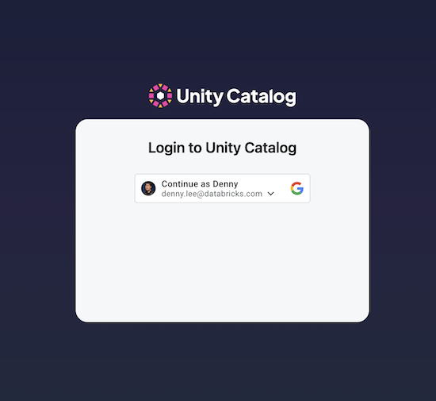
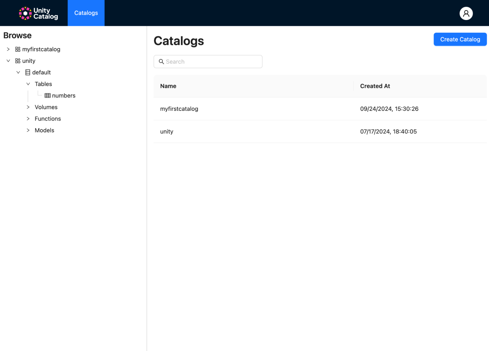
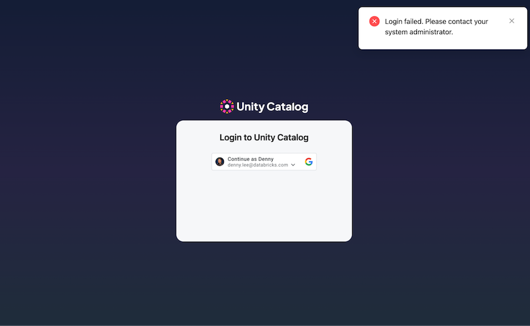
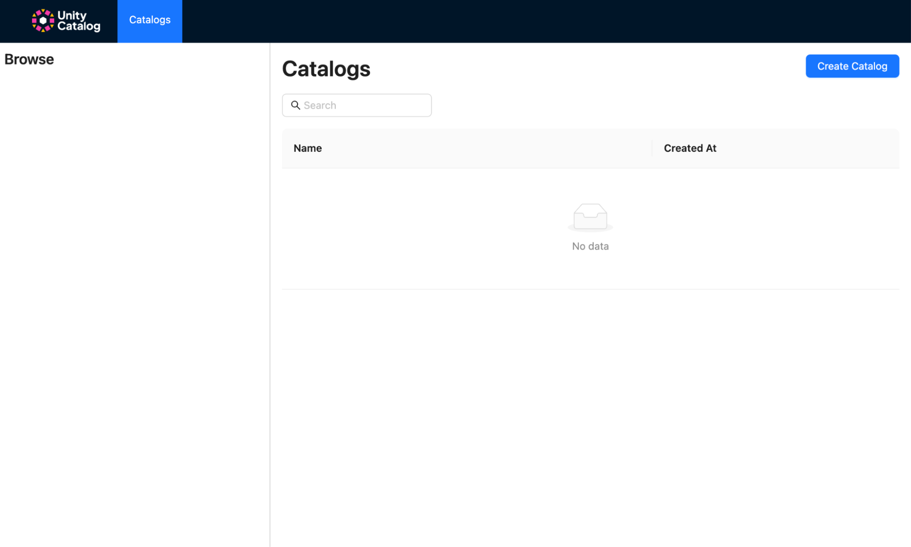

# Rapidstart \- Hello UC\!

This document provides an end-to-end installation and basic testing of all current components of Unity Catalog. It allows developers to try out the major aspects of Unity Catalog on their local machine. This rapid start will also be the basis for the full Unity Catalog Docker.

# Quick Start

To start working with Unity Catalog in your development environment, start with the [Quickstart \- Hello UC\!](https://github.com/unitycatalog/unitycatalog?tab=readme-ov-file#quickstart---hello-uc)  These steps allow you to:

* [Run the UC Server](https://github.com/unitycatalog/unitycatalog?tab=readme-ov-file#run-the-uc-server)  
* [Operate on Delta tables with the CLI](https://github.com/unitycatalog/unitycatalog?tab=readme-ov-file#operate-on-delta-tables-with-the-cli)  
* [Operate on Delta tables with DuckDB](https://github.com/unitycatalog/unitycatalog?tab=readme-ov-file#operate-on-delta-tables-with-duckdb)  
* [Interact with the Unity Catalog tutorial](https://github.com/unitycatalog/unitycatalog?tab=readme-ov-file#interact-with-the-unity-catalog-ui)

# Using Unity Catalog with Apache Spark™ and Delta Lake

For Apache Spark™ and Delta Lake to work together with Unity Catalog, you will need Apache Spark 3.5.3 and Delta Lake 3.2.1.

## Download and Build Unity Catalog Spark Connector

The following steps are required to download and build the Unity Catalog Spark Connector.

### Download Apache Spark™ 3.5.3

Download Apache Spark 3.5.3 at [https://spark.apache.org/downloads.html](https://spark.apache.org/downloads.html) or using the following command.

```bash
curl -O https://archive.apache.org/dist/spark/spark-3.5.3/spark-3.5.3-bin-hadoop3.tgz
tar xzf spark-3.5.3-bin-hadoop3.tgz
```

### \[Optional\] Configure server properties for cloud storage

To have Unity Catalog work with cloud object storage as the storage location for tables, configure the `etc/conf/server.properties` to add configuration:  

```bash
## S3 Storage Config (Multiple configs can be added by incrementing the index)
s3.bucketPath.0=<S3_BUCKET>
s3.region.0=<S3_REGION>
s3.awsRoleArn.0=<S3_ROLE>
# Optional (If blank, it will use DefaultCredentialsProviderChain)
s3.accessKey.0=<SECRET>
s3.secretKey.0=<SECRET>

## ADLS Storage Config (Multiple configs can be added by incrementing the index)
adls.storageAccountName.0=<ADLS_STORAGEACCOUNTNAME>
adls.tenantId.0=<ADLS_TENANTID>
adls.clientId.0=<ADLS_CLIENTID>
adls.clientSecret.0=<SECRET>

## GCS Storage Config (Multiple configs can be added by incrementing the index)
gcs.bucketPath.0=<GCS_BUCKET>
# Optional (If blank, it will use Default Application chain to find credentials)
gcs.jsonKeyFilePath.0=/path/to/<SECRET>/gcp-key-uc-testing.json
```

### \[Optional\] Restart the UC Server

If the UC Server is already started, please restart it to account for the cloud storage server properties.  

```bash
cd unitycatalog/
bin/start-uc-server
```

## Working with Unity Catalog Tables with Spark and Delta Locally

Let’s start running some Spark SQL queries in the Spark SQL shell within the terminal of your Apache Spark 3.5.3 folder against your local UC.

```bash
bin/spark-sql --name "local-uc-test" \
    --master "local[*]" \
    --packages "io.delta:delta-spark_2.12:3.2.1,io.unitycatalog:unitycatalog-spark_2.12:0.2.0" \
    --conf "spark.sql.extensions=io.delta.sql.DeltaSparkSessionExtension" \
    --conf "spark.sql.catalog.spark_catalog=io.unitycatalog.spark.UCSingleCatalog" \
    --conf "spark.sql.catalog.unity=io.unitycatalog.spark.UCSingleCatalog" \
    --conf "spark.sql.catalog.unity.uri=http://localhost:8080" \
    --conf "spark.sql.catalog.unity.token=" \
    --conf "spark.sql.defaultCatalog=unity"
```

Initially, this may take a few minutes to run to download the necessary dependencies.  Afterwards, you can run some quick commands to see your UC assets within Spark SQL shell.

### \[Optional\] Running Spark SQL for Cloud Object Stores

If you would like to run this against cloud object storage, the following versions of the `bin/spark-sql` shell command.

#### AWS S3

```
bin/spark-sql --name "s3-uc-test" \
    --master "local[*]" \
    --packages "org.apache.hadoop:hadoop-aws:3.3.4,io.delta:delta-spark_2.12:3.2.1,io.unitycatalog:unitycatalog-spark_2.12:0.2.0" \
    --conf "spark.sql.extensions=io.delta.sql.DeltaSparkSessionExtension" \
    --conf "spark.sql.catalog.spark_catalog=io.unitycatalog.spark.UCSingleCatalog" \
    --conf "spark.hadoop.fs.s3.impl=org.apache.hadoop.fs.s3a.S3AFileSystem" \
    --conf "spark.sql.catalog.unity=io.unitycatalog.spark.UCSingleCatalog" \
    --conf "spark.sql.catalog.unity.uri=http://localhost:8080" \
    --conf "spark.sql.catalog.unity.token=" \
    --conf "spark.sql.defaultCatalog=unity"
```

#### Azure

```
bin/spark-sql --name "azure-uc-test" \
    --master "local[*]" \
    --packages "org.apache.hadoop:hadoop-azure:3.3.6,io.delta:delta-spark_2.12:3.2.1,io.unitycatalog:unitycatalog-spark_2.12:0.2.0" \
    --conf "spark.sql.extensions=io.delta.sql.DeltaSparkSessionExtension" \
    --conf "spark.sql.catalog.spark_catalog=io.unitycatalog.spark.UCSingleCatalog" \
    --conf "spark.sql.catalog.unity=io.unitycatalog.spark.UCSingleCatalog" \
    --conf "spark.sql.catalog.unity.uri=http://localhost:8080" \
    --conf "spark.sql.catalog.unity.token=" \
    --conf "spark.sql.defaultCatalog=unity"
```

#### GCS

```
bin/spark-sql --name "gcs-uc-test" \
    --master "local[*]" \
    --jars "https://repo1.maven.org/maven2/com/google/cloud/bigdataoss/gcs-connector/3.0.2/gcs-connector-3.0.2-shaded.jar" \
    --packages "io.delta:delta-spark_2.12:3.2.1,io.unitycatalog:unitycatalog-spark_2.12:0.2.0" \
    --conf "spark.sql.extensions=io.delta.sql.DeltaSparkSessionExtension" \
    --conf "spark.sql.catalog.spark_catalog=io.unitycatalog.spark.UCSingleCatalog" \
    --conf "spark.hadoop.fs.gs.impl=com.google.cloud.hadoop.fs.gcs.GoogleHadoopFileSystem" \
    --conf "spark.hadoop.fs.AbstractFileSystem.gs.impl=com.google.cloud.hadoop.fs.gcs.GoogleHadoopFS" \
    --conf "spark.sql.catalog.unity=io.unitycatalog.spark.UCSingleCatalog" \
    --conf "spark.sql.catalog.unity.uri=http://localhost:8080" \
    --conf "spark.sql.catalog.unity.token=" \
    --conf "spark.sql.defaultCatalog=unity"
```

### Quick Start UC from Spark SQL Shell

Let’s start by running some quick commands from the Spark SQL shell.    The following SHOW SCHEMA will show the `default` schema that is by default included in the initial UC configuration. 

```sql
-- Show schemas
SHOW SCHEMAS;
```

 

Next, let’s get the list of tables referenced within your local UC

```sql
-- Show tables
SHOW TABLES IN default;
```

with the output similar to:

```bash
marksheet
marksheet_uniform
numbers
user_countries
Time taken: 0.21 seconds, Fetched 4 row(s)
```

Let’s query the first five rows of the `marksheet` table.

```sql
SELECT * FROM default.marksheet LIMIT 5;
```

With the output looking similar to the following.

```bash
1	nWYHawtqUw	930
2	uvOzzthsLV	166
3	WIAehuXWkv	170
4	wYCSvnJKTo	709
5	VsslXsUIDZ	993
Time taken: 5.347 seconds, Fetched 5 row(s)
```

### UC Table CRUD Operations

Let’s extend this example by executing various CRUD operations on our UC tables.  

```sql
-- Create new schema
CREATE SCHEMA demo;

-- Should now show two schemas: default and demo
SHOW SCHEMAS;

-- Create a new table
CREATE TABLE
demo.mytable (id INT, desc STRING) 
USING delta 
LOCATION '<LOCATION>';
-- Example location:
-- LOCATION '/tmp/tables/mytable';

-- Insert new rows
INSERT INTO demo.mytable VALUES (1, "test 1");
INSERT INTO demo.mytable VALUES (2, "test 2");
INSERT INTO demo.mytable VALUES (3, "test 3");
INSERT INTO demo.mytable VALUES (4, "test 4");

-- Read table
SELECT * FROM demo.mytable;

-- Update row in table
UPDATE demo.mytable SET id = 5 WHERE id = 4;

-- Delete rows
DELETE FROM demo.mytable WHERE id = 5;

-- Create secondary table (we will use this as the source for merge)
CREATE TABLE
demo.srctable (id INT, desc STRING) 
USING delta
LOCATION '<LOCATION>';
-- Example location:
-- LOCATION '/tmp/tables/srctable';

-- Insert new rows
INSERT INTO demo.srctable VALUES (3, "updated");
INSERT INTO demo.srctable VALUES (4, "inserted");

-- Merge
MERGE INTO demo.mytable as target
USING demo.srctable as source
   ON target.id = source.id
 WHEN MATCHED THEN
      UPDATE SET *
 WHEN NOT MATCHED THEN
      INSERT *
;

-- Check results
SELECT * FROM demo.mytable;

-- Results
-- 3       updated
-- 4       inserted
-- 1       test 1
-- 2       test 2

-- Drop tables
-- Note, this action will only drop the table from UC,
--  it will not remove the data from the file system
DROP TABLE demo.srctable;

-- Check results
SHOW TABLES IN default;
```

# Using Unity Catalog and MLflow

A powerful aspect of the Unity Catalog and MLflow integration is that it allows you to manage and provide governance of both your data and ML/AI assets.  To do this, follow the instructions as noted in [Manage models in Unity Catalog using MLflow](https://github.com/unitycatalog/unitycatalog/blob/main/docs/quickstart.md#manage-models-in-unity-catalog-using-mlflow).

In your desired development environment, install MLflow 2.16.1 or higher:

```bash
pip install mlflow
```

The installation of MLflow includes the MLflow CLI tool, so you can start a local MLflow server with UI by running the command below in your terminal:

```bash
mlflow ui
```

It will generate logs with the IP address of the newly started tracking server which can be used in your MLflow python workloads, for example:

```py
import mlflow

mlflow.set_tracking_uri("http://127.0.0.1:5000")
mlflow.set_registry_uri("uc:http://127.0.0.1:8080")
```

At this point, your MLflow environment is ready for use with the newly started MLflow tracking server and the Unity Catalog server acting as your model registry.

You can quickly train a test model and validate that the MLflow/Unity Catalog integration is fully working.

## Register a sample model 

The following code snippet creates a scikit-learn model and registers the model into Unity Catalog. 

```py
import os
from sklearn import datasets
from sklearn.ensemble import RandomForestClassifier
from sklearn.model_selection import train_test_split
import pandas as pd

X, y = datasets.load_iris(return_X_y=True, as_frame=True)
X_train, X_test, y_train, y_test = train_test_split(X, y, test_size=0.2, random_state=42)

with mlflow.start_run():
    # Train a sklearn model on the iris dataset
    clf = RandomForestClassifier(max_depth=7)
    clf.fit(X_train, y_train)
    # Take the first row of the training dataset as the model input example.
    input_example = X_train.iloc[[0]]
    # Log the model and register it as a new version in UC.
    mlflow.sklearn.log_model(
        sk_model=clf,
        artifact_path="model",
        # The signature is automatically inferred from the input example
        # and its predicted output.
        input_example=input_example,
        registered_model_name="unity.default.iris",
    )
```

Upon successful registration of the model, you should see the following output.

```bash
Successfully registered model 'unity.default.iris'.
2024/09/24 20:51:29 INFO mlflow.store.model_registry.abstract_store: Waiting up to 300 seconds for model version to finish creation. Model name: unity.default.iris, version 1
Created version '1' of model 'unity.default.iris'.
<mlflow.models.model.ModelInfo object at 0x13ffb2e80>
2024/09/24 20:51:29 INFO mlflow.tracking._tracking_service.client: 🏃 View run glamorous-gnu-508 at: http://127.0.0.1:5000/#/experiments/0/runs/b3ab03114a4b4b869f3d30070ffc8a1f.
2024/09/24 20:51:29 INFO mlflow.tracking._tracking_service.client: 🧪 View experiment at: http://127.0.0.1:5000/#/experiments/0.
```

The results can be seen in the Unity Catalog UI at [http://localhost:3000,](http://localhost:3000) per the instructions in the [Interact with the Unity Catalog tutorial](https://github.com/unitycatalog/unitycatalog?tab=readme-ov-file#interact-with-the-unity-catalog-ui).  


<hr width=70%>
<br/> &nbsp;

You can also see the model in the MLflow UI at [http://127.0.0.1:5000/](http://127.0.0.1:5000/).  


<hr width=70%>

## Load the sample model 
In a new terminal, you can load your recently registered model using the following code snippet.

```py
from sklearn import datasets
from sklearn.ensemble import RandomForestClassifier
from sklearn.model_selection import train_test_split
import pandas as pd

import mlflow
import mlflow.sklearn
from mlflow.models import infer_signature

mlflow.set_tracking_uri("http://127.0.0.1:5000")
mlflow.set_registry_uri("uc:http://127.0.0.1:8080")

X, y = datasets.load_iris(return_X_y=True, as_frame=True)
X_train, X_test, y_train, y_test = train_test_split(X, y, test_size=0.2, random_state=42)

# Load model
loaded_model = mlflow.pyfunc.load_model(f"models:/unity.default.iris/1")
predictions = loaded_model.predict(X_test)
iris_feature_names = datasets.load_iris().feature_names
result = pd.DataFrame(X_test, columns=iris_feature_names)
result["actual_class"] = y_test
result["predicted_class"] = predictions
result[:4]
```

This code snippet uses the `unity.default.iris` model to predict the class (`predicted_class`) using the test dataset (`X_test`) and compares it to the actual class (`actual_class`) from the Iris dataset. 

```bash
     sepal length (cm)  sepal width (cm)  petal length (cm)  petal width (cm)  actual_class  predicted_class
73                 6.1               2.8                4.7               1.2             1                1
18                 5.7               3.8                1.7               0.3             0                0
118                7.7               2.6                6.9               2.3             2                2
78                 6.0               2.9                4.5               1.5             1                1
```

# Using Unity Catalog with Google Authentication Access Control

You can start testing Unity Catalog Access Control integration with Google Authentication via the following instructions.  

It is important to note that Unity Catalog already has its own local user database to restrict user access.  When you enable Google Authentication, we are now relying on that external provider (in this case, Google Identity) to authenticate.  For access to Unity Catalog authenticated by Google Identity, a user must have a Google Identity (e.g. gmail address) that is added to the local UC database.   

Throughout the next set of examples, we are using Google Identity for authentication while the local Unity Catalog database for authorization.  The permissions (e.g., `USE CATALOG`, `SELECT`, etc.) are the authorized set of tasks the user account can perform.  The user account and what tasks they are authorized to do are stored in your local database.  

## Configure Google as the Identity Provider

Go to the [Google Cloud Console Resource Manager](https://console.cloud.google.com/cloud-resource-manager) to create a new project. 

* Click on **Create Project** and name it (e.g, UC demo)

* Go to your project, then select **APIs & Services \> OAuth consent screen**  
  
    
* Choose **External** and then click **Create**.

* For the **App information** dialog, please provide the *App name*, *user-supported* *email*, and *Developer contact information* at a minimum.  Click **Save and Continue**.

* For the purpose of this demo, skip *Scopes,* *Test users*, and go directly to *Summary* return **Back to Dashboard**.


* Click **APIs & Services \> Credentials** and click the **Create Credentials** button to create an **OAuth client ID**.  
  * **Application type**:  Web application  
  * **Name**: UC demo web client  
  * **Authorized JavaScript origins**: http://localhost, http://localhost:3000 (this is required for the UI)  
  * **Authorized redirect URIs**: http://localhost, http://localhost:3000 (this is required for the UI)

  

* Once the OAuth client ID is created, a pop-up dialog box will appear containing the **Client ID** and **client secret**. Make sure to copy and/or download it (via the Download JSON button), as this will be needed in the following steps.

  

## Configure UC Server Settings

Start by editing `etc/conf/server.properties` with the aforementioned **Client ID** and **Client secret**.

```bash
server.authorization=enable
server.authorization-url=https://accounts.google.com/o/oauth2/auth
server.token-url=https://oauth2.googleapis.com/token
server.client-id=<Client ID provided earlier>
server.client-secret=<Client secret provided earlier>
```

## Restart the UC Server

Now that the Google Authentication is configured, restart the UC Server with the following command. 

```bash
bin/start-uc-server
```

Behind the scenes, on startup, the UC server will configure itself with the following:

* Creation of internal signing keys and authentication files in `etc/conf`  
* Creation of an admin access token in `etc/conf/token.txt`
* Creation of an admin account in the user database  
* Granting the admin account as the metastore admin for the server


## Testing User and Admin Authentication

The following steps allow you to test user and admin authentication to your local Unity Catalog.

### Use admin token to verify admin user is in local database

As noted earlier, on startup the UC server configured itself and created the admin access token at `etc/conf/token.txt`.  The following command uses the same admin authentication token to view the user list.

```bash
bin/uc --auth_token $(cat etc/conf/token.txt) user list
```

The output should look something like this

```console
┌────────────────────────────────────┬─────────┬────────────────────────┬───────────┬───────┬───────────┬─────────────┬─────────────┐
│                 ID                 │  NAME   │         EMAIL          │EXTERNAL_ID│ STATE │PICTURE_URL│ CREATED_AT  │ UPDATED_AT  │
├────────────────────────────────────┼─────────┼────────────────────────┼───────────┼───────┼───────────┼─────────────┼─────────────┤
│c6e354c9-ec27-4815-9212-4bdb4fdbfea4│Admin    │admin                   │null       │ENABLED│null       │1727198813231│1727220886536│
├────────────────────────────────────┼─────────┼────────────────────────┼───────────┼───────┼───────────┼─────────────┼─────────────┤
```

### Try to log in with no user in the local database

As noted earlier, Unity Catalog has a local database that contains the users allowed to access it. While an administrative account was created, no user account has been created yet. Thus, the following command **will fail**.

```bash
bin/uc auth login
```

Your browser will open and you will authenticate with the specific Google identity (e.g., bobbie@rocinante).  While authenticated, the user account has not been added to the local database.  Hence the command will fail with the output similar to the following:

```console
Listening on port: 61918
Attempting to open the authorization page in your default browser.
If the browser does not open, you can manually open the following URL:

https://accounts.google.com/o/oauth2/auth?client_id=$$.apps.googleusercontent.com&redirect_uri=http%3A%2F%2Flocalhost%3A61918&response_type=code&scope=openid+profile+email&state=$$

Received authentication response.
Received token response.
Exception in thread "main" java.lang.RuntimeException: io.unitycatalog.client.ApiException: Error authenticating - {"error_code":"INVALID_ARGUMENT","details":[{"reason":"INVALID_ARGUMENT","metadata":{},"@type":"google.rpc.ErrorInfo"}],"stack_trace":null,"message":"User not allowed: bobbie@rocinante"}
    at io.unitycatalog.cli.UnityCatalogCli.main(UnityCatalogCli.java:168)
Caused by: io.unitycatalog.client.ApiException: Error authenticating - {"error_code":"INVALID_ARGUMENT","details":[{"reason":"INVALID_ARGUMENT","metadata":{},"@type":"google.rpc.ErrorInfo"}],"stack_trace":null,"message":"User not allowed: bobbie@rocinante"}
    at io.unitycatalog.cli.AuthCli.doExchange(AuthCli.java:102)
    at io.unitycatalog.cli.AuthCli.login(AuthCli.java:62)
    at io.unitycatalog.cli.AuthCli.handle(AuthCli.java:46)
    at io.unitycatalog.cli.UnityCatalogCli.main(UnityCatalogCli.java:124)
```

Note, `bobbie@rocinante` is not a real Google Identity account, please replace this with your own.

### Add user account to the local database

To fix this error, let’s start by adding your user account to the UC local database.  Use the CLI with the admin token to add your account to the local database.

```bash
bin/uc --auth_token $(cat etc/conf/token.txt) user create --name "Bobbie Draper" --email bobbie@rocinante
```

### Try to log in with your user account

Now use the CLI to authenticate and gain an access token using the account that has been created.

```bash
bin/uc auth login --output jsonPretty
```

Similar to the previous steps, your browser will open and you will authenticate with the specific Google identity (e.g., bobbie@rocinante).  This time it should succeed provided the Google Identity you are authenticating with is the same one authorized in the Unity Catalog local database.  The output should be similar to the following

```console
Listening on port: 51798
Attempting to open the authorization page in your default browser.
If the browser does not open, you can manually open the following URL:

https://accounts.google.com/o/oauth2/auth?client_id=$$.apps.googleusercontent.com&redirect_uri=http%3A%2F%2Flocalhost%3A51798&response_type=code&scope=openid+profile+email&state=$$

Received authentication response.
Received token response.
{
  "access_token" : "exJ...N8zt$w"
}
```

Save the returned token in an environment variable for later

```bash
export token='exJ...N8zt$w'
```

### Try to list catalogs with your user account

Note, that while we have authenticated (with Google Identity) your account with an authorized user in the local database, that user does not yet have any permissions.  Thus if one tries to list catalogs, an unauthenticated user will fail, your user account will return nothing (as it does not have permission to list), and the admin account will succeed.

```bash
# Fails as the user is UNAUTHENTICATED
bin/uc catalog list

# Returns nothing
bin/uc --auth_token $token catalog list

# Succeeds
bin/uc --auth_token $(cat etc/conf/token.txt) catalog list
```

But if you were to add `USE CATALOG` permission to your user account 

```bash
bin/uc --auth_token $(cat etc/conf/token.txt) permission create  --securable_type catalog --name unity --privilege 'USE CATALOG' --principal bobbie@rocinante 
```

then the following command would work.

```bash
# Succeeds
bin/uc --auth_token $token catalog list
```

### Try creating a catalog with your user account

The following command will initially **fail** as your user account does not have permissions to create a catalog.

```bash
bin/uc --auth_token $token catalog create --name myfirstcatalog
```

Thus, let’s provide your account with the necessary permissions.

```bash
bin/uc --auth_token $(cat etc/conf/token.txt) permission create --securable_type metastore --name metastore --privilege "CREATE CATALOG" --principal bobbie@rocinante
```

With the permission set, the preceding command will succeed because your user account has the `CREATE CATALOG` permissions.

### Try to access your table using DuckDB

First, let’s give our user account (`bobbie@rocinante`) `USE CATALOG`, `USE` `SCHEMA`, and `SELECT` permissions. Notice how we’re providing access using the three-part naming convention of *catalog, schema, and table*. As we provide each level of permissions, we progress down the three parts. 

```bash
bin/uc --auth_token $(cat etc/conf/token.txt ) permission create --securable_type catalog --name unity --privilege "USE CATALOG" --principal bobbie@rocinante 
bin/uc --auth_token $(cat etc/conf/token.txt ) permission create --securable_type schema --name unity.default --privilege "USE SCHEMA" --principal bobbie@rocinante
bin/uc --auth_token $(cat etc/conf/token.txt ) permission create --securable_type table --name unity.default.numbers --privilege "SELECT" --principal bobbie@rocinante
```

Then start a new DuckDB session.

```bash
duckdb
```

Within the `duckdb` session, let’s query the `unity.default.numbers` table.  Note the `CREATE SECRET` statement uses the auth\_token (`$token`) thus please fill the `TOKEN` field in with your saved `$token` value.

```sql
install uc_catalog from core_nightly;
load uc_catalog;
install delta;
load delta;

CREATE SECRET (
      TYPE UC,
      TOKEN 'exJ...N8zt$w',
      ENDPOINT 'http://127.0.0.1:8080',
      AWS_REGION 'us-east-2'
 );

ATTACH 'unity' AS unity (TYPE UC_CATALOG);

SHOW ALL TABLES;
SELECT * from unity.default.numbers;
```

## Using Spark with a User Token

Now that you have enabled Google Authentication for your UC instance, any unauthenticated clients such as a spark-sql shell without using an identity token will fail.  For example, if you were to run the `SHOW SCHEMA` step in the [working with Unity Catalog Tables with Spark](#working-with-unity-catalog-tables-with-spark-and-delta-locally) using the unauthenticated spark-sql command, you would get the following error.

```console
spark-sql ()> SHOW SCHEMAS;
24/09/25 15:36:28 ERROR SparkSQLDriver: Failed in [SHOW SCHEMAS]
io.unitycatalog.client.ApiException: listSchemas call failed with: 401 - {"error_code":"UNAUTHENTICATED","details":[{"reason":"UNAUTHENTICATED","metadata":{},"@type":"google.rpc.ErrorInfo"}],"stack_trace":null,"message":"No authorization found."}
    at io.unitycatalog.client.api.SchemasApi.getApiException(SchemasApi.java:77)
    at io.unitycatalog.client.api.SchemasApi.listSchemasWithHttpInfo(SchemasApi.java:358)
```

To solve this issue, ensure that the configuration spark.sql.catalog.unity.token is populated  such as using the `$token` environment variable that you had set in the [try to log in with your user account](#try-to-log-in-with-your-user-account) step.

```bash
bin/spark-sql --name "local-uc-test" \
    --master "local[*]" \
    --packages "io.delta:delta-spark_2.12:3.2.1,io.unitycatalog:unitycatalog-spark_2.12:0.2.0" \
    --conf "spark.sql.extensions=io.delta.sql.DeltaSparkSessionExtension" \
    --conf "spark.sql.catalog.spark_catalog=io.unitycatalog.spark.UCSingleCatalog" \
    --conf "spark.sql.catalog.unity=io.unitycatalog.spark.UCSingleCatalog" \
    --conf "spark.sql.catalog.unity.uri=http://localhost:8080" \
    --conf "spark.sql.catalog.unity.token=$token" \
    --conf "spark.sql.defaultCatalog=unity"
```

With this set, now you can continue your [Quick Start UC from Spark SQL Shell](#quick-start-uc-from-spark-sql-shell) and [UC Table CRUD Operations](#quick-start-uc-from-spark-sql-shell) steps with Spark as an authenticated client to UC.

## Using Google Identity with Unity Catalog UI

We previously configured Google as the Identity Provider and configured UC Server settings for CLI access. However, we can also apply this authentication and authorization to the Unity Catalog UI. 

### Configure and restart the Unity Catalog UI

First, you will need to edit the `ui/.env` file to enable Google Auth and add the Google Client ID that you created when you previously [configured Google as the Identity Provider](#configure-google-as-the-identity-provider).

```bash
REACT_APP_GOOGLE_AUTH_ENABLED=true
REACT_APP_GOOGLE_CLIENT_ID=<Client ID provided earlier>
```

If you have not already done so, restart the UI.

```bash
cd ui
yarn install
yarn start
```

This will open a new browser window with the Google Auth Login.  


<br/> &nbsp;

Upon authentication, you will be able to view your Unity Catalog data and AI assets including the catalog (`myfirstcatalog`) you recently created in the [try creating a catalog with your account](#try-creating-a-catalog-with-your-user-account) step.  



### \[Optional\] Understanding Server and UI authentication

Unity Catalog requires both the server and the UI to be authenticated \- in this case using Google Identity.  If either or both are disabled, it will result in the following expected errors.

**Disabling Server authentication, UI authenticated is enabled**  
Modify the `server.properties` file to disable the server authentication by changing server.authorization to disabled.

```bash
server.authorization=disable
```

Restarting your UC server (i.e., `bin/start-uc-server`)  and UI (i.e., `yarn start`) will open a new browser window with the Google Auth login but fail with the following login failed error.


<br>&nbsp;

**Enabling server authentication, UI authentication is disabled**  
Let’s go the other way and enable server authentication and disable UI authentication.  Modify `server.properties` so it is now enabled

```bash
server.authorization=enable
```

and edit `ui/.env` file so the UI authentication is disabled.

```bash
REACT_APP_GOOGLE_AUTH_ENABLED=false
REACT_APP_GOOGLE_CLIENT_ID=
```

Restarting your UC server (i.e., `bin/start-uc-server`)  and UI (i.e., `yarn start`) will open a new browser window with the Google Auth login.  You will successfully log into the UI but fail to show any Unity Catalog assets as the UI is not authenticated to query those assets.



**Disable both server and authentication**   
Finally, let’s disable both server and UI authentication by modifying the `server.properties` 

```bash
server.authorization=disable
```

and the `ui/.env` file so both are disabled.

```bash
REACT_APP_GOOGLE_AUTH_ENABLED=false
REACT_APP_GOOGLE_CLIENT_ID=
```

Restarting your UC server (i.e., `bin/start-uc-server`)  and UI (i.e., `yarn start`) will open a new browser window with the Google Auth login.  In this case, there will be **no profile menu nor any login screen** but you will be able to see your UC assets. 