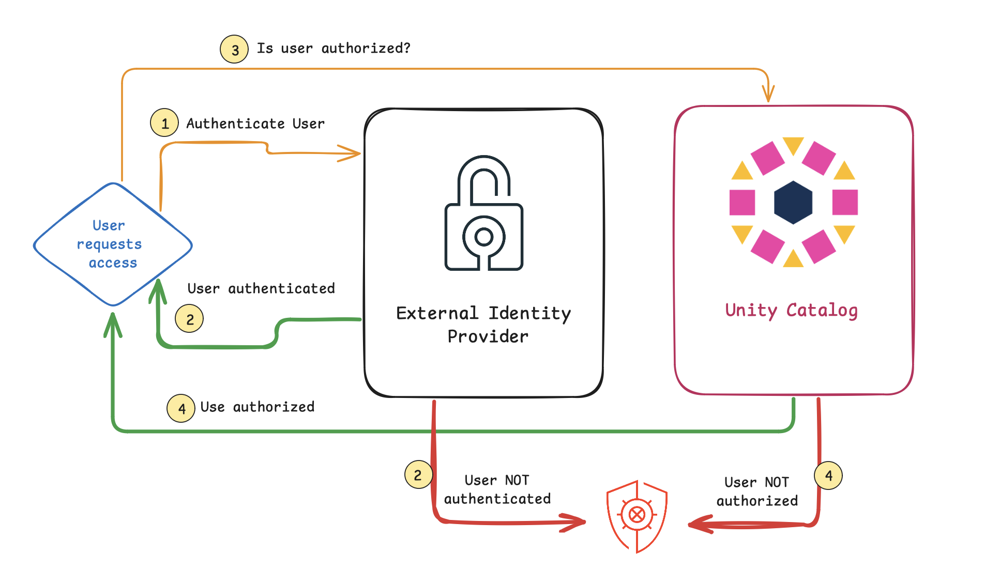
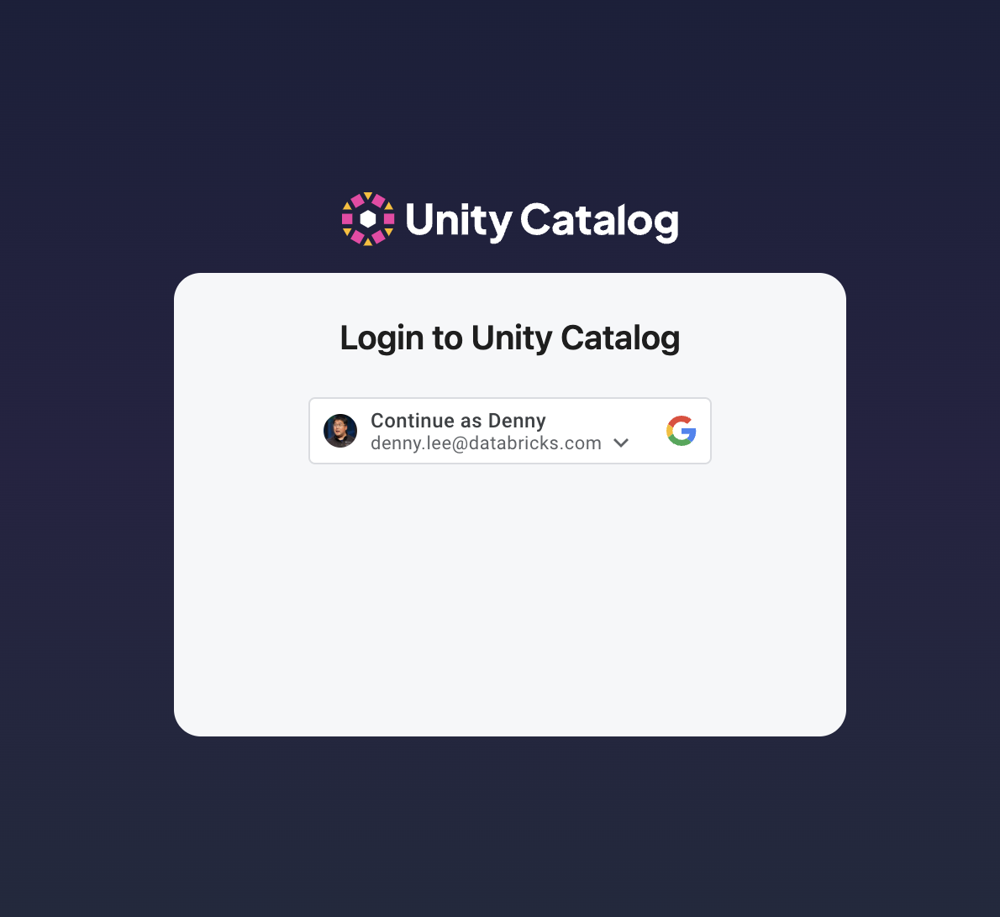
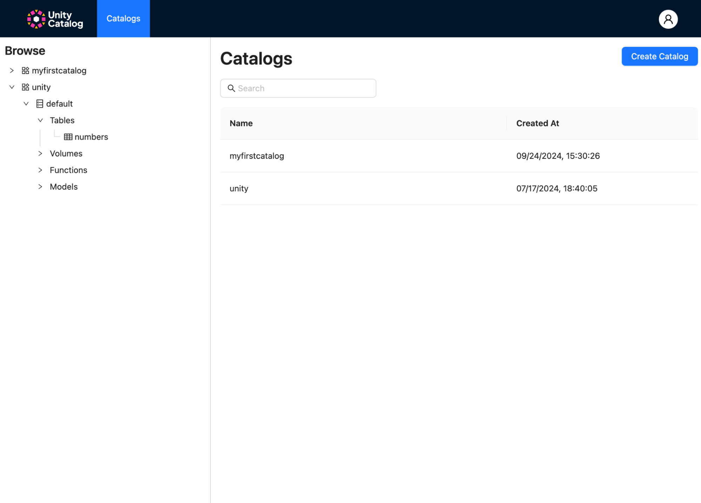
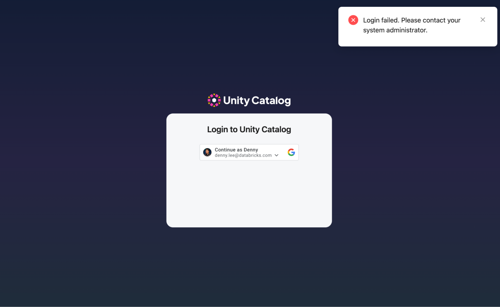
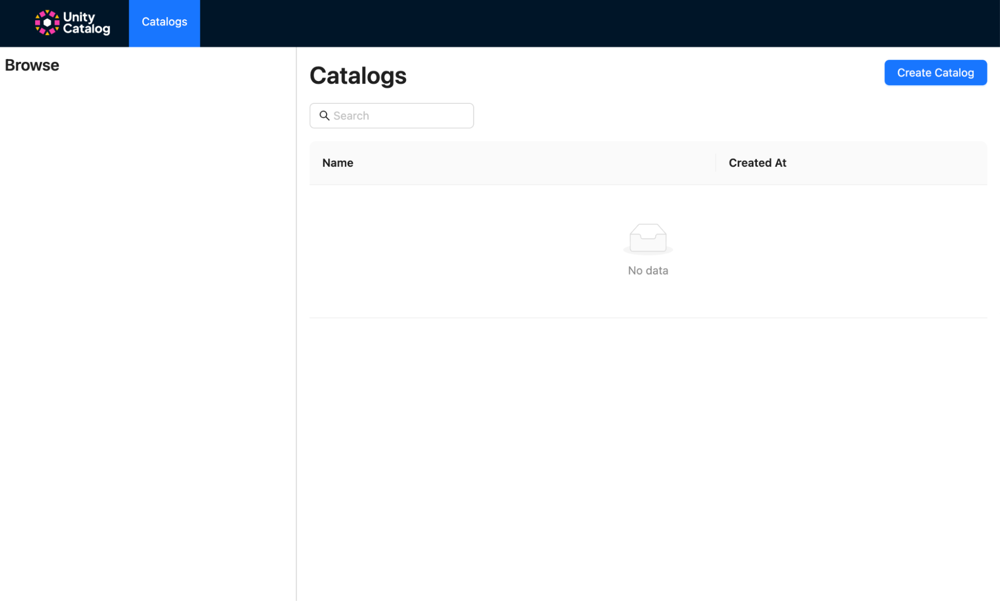

# Unity Catalog Authentication and Authorization

You can start working with Unity Catalog Access Control integration with an external authentication provider
(e.g., Google Auth, Okta, etc.) via the following instructions.

It is important to note that Unity Catalog already has its own local user database to restrict user access. When you
work with an external authentication provider, we are now relying on that external provider (e.g., Google Identity)
to authenticate. For example, for access to Unity Catalog authenticated by Google Identity, a user must have a
Google Identity (e.g. gmail address) that is added to the local UC database.



Throughout the next set of examples, we are using an external identity provider for authentication while the local
Unity Catalog database for authorization. The flow is as follows:

1. The user account used will **authenticate** against an external authentication provider to confirm the user is who
    they say they are (e.g., `bobbie@rocinante` is in fact Bobbie Draper on the Rocinante)
2. The user account is either **authenticated** and a *user token is provided* or **not authenticated**.
3. With the token at hand, the user account also needs to request if they are **authorized** to perform the task
    (e.g., the user can only read tables but not write any tables).  This authorization step is performed with the
    Unity Catalog database.
4. The user account is either **authorized** and they can perform the task or **not authorized**.

## Configure your External Identity Provider

To try out authentication and authorization, first configure your preferred external identity provider following their
instructions. Ultimately you will have configuration properties to configure:

* `etc/conf/server.properties` to fill in the Identity Provider authorization parameters
* [Optional] `ui/.env` so the Unity Catalog UI can also use the same `client_id`.  

!!! note "Unity Catalog UI supported Identity Authentication Providers"
    Currently, the Unity Catalog User Interface supports Google Identity Provider.

You can follow [these instructions](./google-auth.md) if would like to use Google as your external identity provider.

Once you have configured your identity provider, the next step is to configure your Unity Catalog server settings.

## Configure UC Server Settings

Start by editing `etc/conf/server.properties` with the **Client ID** and **Client secret** provided to you by the
Identity Provider.

```sh
server.authorization=enable
server.authorization-url=https://accounts.google.com/o/oauth2/auth
server.token-url=https://oauth2.googleapis.com/token
server.client-id=<Client ID provided earlier>
server.client-secret=<Client secret provided earlier>
```

### Restart the UC Server

Now that the Google Authentication is configured, restart the UC Server with the following command.

```sh
bin/start-uc-server
```

Behind the scenes, on startup, the UC server will configure itself with the following:

* Creation of internal signing keys and authentication files in `etc/conf`
* Creation of an admin access token in `etc/conf/token.txt`
* Creation of an admin account in the user database
* Granting the admin account as the metastore admin for the server

## Testing User and Admin Authentication

The following steps allow you to test user and admin authentication to your local Unity Catalog.

### Use admin token to verify admin user is in local database

As noted earlier, on startup the UC server configured itself and created the admin access token at
`etc/conf/token.txt`. The following command uses the same admin authentication token to view the user list.

```sh
bin/uc --auth_token $(cat etc/conf/token.txt) user list
```

The output should look something like this

```console
┌────────────────────────────────────┬─────────┬────────────────────────┬───────────┬───────┬───────────┬─────────────┬─────────────┐
│                 ID                 │  NAME   │         EMAIL          │EXTERNAL_ID│ STATE │PICTURE_URL│ CREATED_AT  │ UPDATED_AT  │
├────────────────────────────────────┼─────────┼────────────────────────┼───────────┼───────┼───────────┼─────────────┼─────────────┤
│c6e354c9-ec27-4815-9212-4bdb4fdbfea4│Admin    │admin                   │null       │ENABLED│null       │1727198813231│1727220886536│
├────────────────────────────────────┼─────────┼────────────────────────┼───────────┼───────┼───────────┼─────────────┼─────────────┤
```

### Try to log in with no user in the local database

As noted earlier, Unity Catalog has a local database that contains the users allowed to access it. While an
administrative account was created, no user account has been created yet. Thus, the following command **will fail**.

```sh
bin/uc auth login
```

Your browser will open and you will authenticate with the specific Google identity (e.g., bobbie@rocinante). While
authenticated, the user account has not been added to the local database.  Hence the command will fail with the output
similar to the following:

```console
Listening on port: 61918
Attempting to open the authorization page in your default browser.
If the browser does not open, you can manually open the following URL:

https://accounts.google.com/o/oauth2/auth?client_id=$$.apps.googleusercontent.com&redirect_uri=http%3A%2F%2Flocalhost%3A61918&response_type=code&scope=openid+profile+email&state=$$

Received authentication response.
Received token response.
Exception in thread "main" java.lang.RuntimeException: io.unitycatalog.client.ApiException: Error authenticating - {"error_code":"INVALID_ARGUMENT","details":[{"reason":"INVALID_ARGUMENT","metadata":{},"@type":"google.rpc.ErrorInfo"}],"stack_trace":null,"message":"User not allowed: bobbie@rocinante"}
    at io.unitycatalog.cli.UnityCatalogCli.main(UnityCatalogCli.java:168)
Caused by: io.unitycatalog.client.ApiException: Error authenticating - {"error_code":"INVALID_ARGUMENT","details":[{"reason":"INVALID_ARGUMENT","metadata":{},"@type":"google.rpc.ErrorInfo"}],"stack_trace":null,"message":"User not allowed: bobbie@rocinante"}
    at io.unitycatalog.cli.AuthCli.doExchange(AuthCli.java:102)
    at io.unitycatalog.cli.AuthCli.login(AuthCli.java:62)
    at io.unitycatalog.cli.AuthCli.handle(AuthCli.java:46)
    at io.unitycatalog.cli.UnityCatalogCli.main(UnityCatalogCli.java:124)
```

!!! warning
    Note, `bobbie@rocinante` is not a real Google Identity account, please replace this with your own.

### Add user account to the local database

To fix this error, let’s start by adding your user account to the UC local database. Use the CLI with the admin token
to add your account to the local database.

```sh
bin/uc --auth_token $(cat etc/conf/token.txt) user create --name "Bobbie Draper" --email bobbie@rocinante
```

### Try to log in with your user account

Now use the CLI to authenticate and gain an access token using the account that has been created.

```sh
bin/uc auth login --output jsonPretty
```

Similar to the previous steps, your browser will open and you will authenticate with the specific Google identity
(e.g., `bobbie@rocinante`). This time it should succeed provided the Google Identity you are authenticating with is the
same one authorized in the Unity Catalog local database. The output should be similar to the following

```console
Listening on port: 51798
Attempting to open the authorization page in your default browser.
If the browser does not open, you can manually open the following URL:

https://accounts.google.com/o/oauth2/auth?client_id=$$.apps.googleusercontent.com&redirect_uri=http%3A%2F%2Flocalhost%3A51798&response_type=code&scope=openid+profile+email&state=$$

Received authentication response.
Received token response.
{
  "access_token" : "exJ...N8zt$w"
}
```

Save the returned token in an environment variable for later

```sh
export token='exJ...N8zt$w'
```

### Try to list catalogs with your user account

Note, that while we have authenticated (with Google Identity) your account with an authorized user in the local
database, that user does not yet have any permissions. Thus if one tries to list catalogs, an unauthenticated user will
fail, your user account will return nothing (as it does not have permission to list), and the admin account will
succeed.

```sh
# Fails as the user is UNAUTHENTICATED
bin/uc catalog list

# Returns nothing
bin/uc --auth_token $token catalog list

# Succeeds
bin/uc --auth_token $(cat etc/conf/token.txt) catalog list
```

But if you were to add `USE CATALOG` permission to your user account

```sh
bin/uc --auth_token $(cat etc/conf/token.txt) permission create  --securable_type catalog --name unity --privilege 'USE CATALOG' --principal bobbie@rocinante 
```

then the following command would work.

```sh
# Succeeds
bin/uc --auth_token $token catalog list
```

### Try creating a catalog with your user account

The following command will initially **fail** as your user account does not have permissions to create a catalog.

```sh
bin/uc --auth_token $token catalog create --name myfirstcatalog
```

Thus, let’s provide your account with the necessary permissions.

```sh
bin/uc --auth_token $(cat etc/conf/token.txt) permission create --securable_type metastore --name metastore --privilege "CREATE CATALOG" --principal bobbie@rocinante
```

With the permission set, the preceding command will succeed because your user account has the `CREATE CATALOG`
permissions.

### Try to access your table using DuckDB

First, let’s give our user account (`bobbie@rocinante`) `USE CATALOG`, `USE SCHEMA`, and `SELECT` permissions.
Notice how we’re providing access using the three-part naming convention of *catalog, schema, and table*. As we provide
each level of permissions, we progress down the three parts.

```sh
bin/uc --auth_token $(cat etc/conf/token.txt ) permission create --securable_type catalog --name unity --privilege "USE CATALOG" --principal bobbie@rocinante 
bin/uc --auth_token $(cat etc/conf/token.txt ) permission create --securable_type schema --name unity.default --privilege "USE SCHEMA" --principal bobbie@rocinante
bin/uc --auth_token $(cat etc/conf/token.txt ) permission create --securable_type table --name unity.default.numbers --privilege "SELECT" --principal bobbie@rocinante
```

Then start a new DuckDB session.

```sh
duckdb
```

Within the `duckdb` session, let’s query the `unity.default.numbers` table. Note the `CREATE SECRET` statement uses
the auth\_token (`$token`) thus please fill the `TOKEN` field in with your saved `$token` value.

```sql
install uc_catalog from core_nightly;
load uc_catalog;
install delta;
load delta;

CREATE SECRET (
      TYPE UC,
      TOKEN 'exJ...N8zt$w',
      ENDPOINT 'http://127.0.0.1:8080',
      AWS_REGION 'us-east-2'
 );

ATTACH 'unity' AS unity (TYPE UC_CATALOG);

SHOW ALL TABLES;
SELECT * from unity.default.numbers;
```

## Using Spark with a User Token

Now that you have enabled Google Authentication for your UC instance, any unauthenticated clients such as a spark-sql
shell without using an identity token will fail.  For example, if you were to run the `SHOW SCHEMA` step in the
[working with Unity Catalog Tables with Spark](../integrations/unity-catalog-spark.md) using the unauthenticated
spark-sql command, you would get the following error.

```console
spark-sql ()> SHOW SCHEMAS;
24/09/25 15:36:28 ERROR SparkSQLDriver: Failed in [SHOW SCHEMAS]
io.unitycatalog.client.ApiException: listSchemas call failed with: 401 - {"error_code":"UNAUTHENTICATED","details":[{"reason":"UNAUTHENTICATED","metadata":{},"@type":"google.rpc.ErrorInfo"}],"stack_trace":null,"message":"No authorization found."}
    at io.unitycatalog.client.api.SchemasApi.getApiException(SchemasApi.java:77)
    at io.unitycatalog.client.api.SchemasApi.listSchemasWithHttpInfo(SchemasApi.java:358)
```

To solve this issue, ensure that the configuration spark.sql.catalog.unity.token is populated  such as using the
`$token` environment variable that you had set in the [try to log in with your user account](#try-to-log-in-with-your-user-account)
step.

```sh
bin/spark-sql --name "local-uc-test" \
    --master "local[*]" \
    --packages "io.delta:delta-spark_2.12:3.2.1,io.unitycatalog:unitycatalog-spark_2.12:0.2.0" \
    --conf "spark.sql.extensions=io.delta.sql.DeltaSparkSessionExtension" \
    --conf "spark.sql.catalog.spark_catalog=io.unitycatalog.spark.UCSingleCatalog" \
    --conf "spark.sql.catalog.unity=io.unitycatalog.spark.UCSingleCatalog" \
    --conf "spark.sql.catalog.unity.uri=http://localhost:8080" \
    --conf "spark.sql.catalog.unity.token=$token" \
    --conf "spark.sql.defaultCatalog=unity"
```

With this set, now you can continue your [Using Spark SQL to query Unity Catalog schemas and tables](../integrations/unity-catalog-spark.md#using-spark-sql-to-query-unity-catalog-schemas-and-tables)
and [Running CRUD Operations on a Unity Catalog table](../integrations/unity-catalog-spark.md#running-crud-operations-on-a-unity-catalog-table)
steps with Spark as an authenticated client to UC.

## Using Google Identity with Unity Catalog UI

We previously configured Google as the Identity Provider and configured UC Server settings for CLI access. However, we
can also apply this authentication and authorization to the Unity Catalog UI.

### Configure and restart the Unity Catalog UI

First, you will need to edit the `ui/.env` file to enable Google Auth and add the Google Client ID that you created
when you - in this example - previously [configured Google as the Identity Provider](./google-auth.md).

```sh
REACT_APP_GOOGLE_AUTH_ENABLED=true
REACT_APP_GOOGLE_CLIENT_ID=<Client ID provided earlier>
```

If you have not already done so, restart the UI.

```sh
cd ui
yarn install
yarn start
```

This will open a new browser window with your identity provider login (e.g., Google Identity).



Upon authentication, you will be able to view your Unity Catalog data and AI assets including the catalog
(`myfirstcatalog`) you recently created in the [try creating a catalog with your account](#try-creating-a-catalog-with-your-user-account)
step.  



## [Optional] Understanding Server and UI authentication

Unity Catalog requires both the server and the UI to be authenticated \- in this case using Google Identity. If either
or both are disabled, it will result in the following expected errors.

### Disabling Server authentication, UI authenticated is enabled

Modify the `server.properties` file to disable the server authentication by changing server.authorization to disabled.

```sh
server.authorization=disable
```

Restarting your UC server (i.e., `bin/start-uc-server`) and UI (i.e., `yarn start`) will open a new browser window
with the Google Auth login but fail with the following login failed error.



### Enabling server authentication, UI authentication is disabled

Let’s go the other way and enable server authentication and disable UI authentication. Modify `server.properties` so
it is now enabled

```sh
server.authorization=enable
```

and edit `ui/.env` file so the UI authentication is disabled.

```sh
REACT_APP_GOOGLE_AUTH_ENABLED=false
REACT_APP_GOOGLE_CLIENT_ID=
```

Restarting your UC server (i.e., `bin/start-uc-server`)  and UI (i.e., `yarn start`) will open a new browser window
with the Google Auth login. You will successfully log into the UI but fail to show any Unity Catalog assets as the UI
is not authenticated to query those assets.



### Disable both server and authentication

Finally, let’s disable both server and UI authentication by modifying the `server.properties`

```sh
server.authorization=disable
```

and the `ui/.env` file so both are disabled.

```sh
REACT_APP_GOOGLE_AUTH_ENABLED=false
REACT_APP_GOOGLE_CLIENT_ID=
```

Restarting your UC server (i.e., `bin/start-uc-server`) and UI (i.e., `yarn start`) will open a new browser window
with the Google Auth login. In this case, there will be **no profile menu nor any login screen** but you will be able
to see your UC assets.
