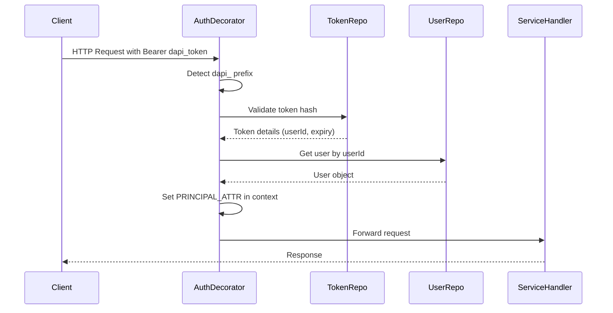

# DAPI Token Implementation in Unity Catalog

This document describes the technical implementation of Developer API (DAPI) tokens in Unity Catalog, including authentication flows, authorization, and integration points.

## Overview

Unity Catalog's DAPI token implementation provides a secure authentication mechanism for CLI, API, and Spark integration. DAPI tokens use the `dapi_` prefix and support the full range of Unity Catalog operations based on user permissions.

## Implementation Details

### Token Format

DAPI tokens use a specific format for easy identification:

- **Prefix**: `dapi_` 
- **Length**: 50+ characters (base64-encoded random bytes)
- **Example**: `dapi_rwNSYEki6vow5jOI6MdDWJY-A4lkW-vWzZyAh-18q54`

### Authentication Flow



### Key Components

#### 1. AuthDecorator.java

The `AuthDecorator` class handles both JWT and DAPI token authentication:

```java
public class AuthDecorator implements HttpService {
    
    // Handle DAPI token authentication
    private HttpResponse handleDapiTokenAuth(
        HttpService delegate, ServiceRequestContext ctx, HttpRequest req, String token)
        throws Exception {
        
        // Validate token format and retrieve from database
        DeveloperTokenDAO tokenDAO = developerTokenRepository.getTokenByHash(hashToken(token));
        
        // Check expiration
        if (tokenDAO.getExpiryTime().before(new Date())) {
            throw new AuthorizationException(ErrorCode.PERMISSION_DENIED, "DAPI token expired.");
        }
        
        // Get associated user
        User user = userRepository.getUserById(tokenDAO.getUserId());
        
        // Set user in context for authorization
        ctx.setAttr(PRINCIPAL_ATTR, user);
        
        return delegate.serve(ctx, req);
    }
}
```

#### 2. IdentityUtils.java

Updated to support both JWT and DAPI token contexts:

```java
public class IdentityUtils {
    
    public static String findPrincipalEmailAddress() {
        ServiceRequestContext ctx = ServiceRequestContext.current();
        
        // First try to get user from DAPI token authentication
        User user = ctx.attr(AuthDecorator.PRINCIPAL_ATTR);
        if (user != null) {
            return user.getEmail();
        }
        
        // Fall back to JWT authentication
        DecodedJWT decodedJWT = ctx.attr(AuthDecorator.DECODED_JWT_ATTR);
        if (decodedJWT != null) {
            Claim sub = decodedJWT.getClaim(JwtClaim.SUBJECT.key());
            return sub.asString();
        }
        
        return null;
    }
}
```

#### 3. DeveloperTokenRepository.java

Manages DAPI token persistence and validation:

```java
public class DeveloperTokenRepository {
    
    public DeveloperTokenDAO getTokenByHash(String tokenHash) {
        return sessionFactory.fromSession(session -> {
            Query<DeveloperTokenDAO> query = session.createQuery(
                "FROM DeveloperTokenDAO WHERE tokenHash = :tokenHash", 
                DeveloperTokenDAO.class);
            query.setParameter("tokenHash", tokenHash);
            return query.uniqueResult();
        });
    }
}
```

### Authorization Integration

DAPI tokens integrate with Unity Catalog's existing authorization system:

1. **Principal Resolution**: `UserRepository.findPrincipalId()` uses `IdentityUtils.findPrincipalEmailAddress()`
2. **Permission Evaluation**: `UnityAccessEvaluator.evaluate()` receives the user's UUID for authorization checks
3. **Admin Operations**: Users with OWNER privileges can perform administrative tasks

### Database Schema

DAPI tokens are stored in the `developer_tokens` table:

```sql
CREATE TABLE developer_tokens (
    id UUID PRIMARY KEY,
    user_id VARCHAR(255) NOT NULL,
    comment TEXT,
    token_hash VARCHAR(255) NOT NULL UNIQUE,
    created_at TIMESTAMP DEFAULT CURRENT_TIMESTAMP,
    expiry_time TIMESTAMP NOT NULL,
    status VARCHAR(20) DEFAULT 'ACTIVE'
);
```

### Security Features

1. **Token Hashing**: Only bcrypt hashes are stored in the database
2. **Expiration**: Configurable TTL with automatic expiration checking
3. **Revocation**: Tokens can be revoked by setting status to 'REVOKED'
4. **Write-Once**: Token values are only displayed during creation
5. **Scope Inheritance**: Tokens inherit the creating user's permissions

## Supported Operations

### CLI Integration

All Unity Catalog CLI commands support DAPI token authentication:

```bash
bin/uc --auth_token $UC_DAPI_TOKEN [command] [options]
```

**Examples:**
- `bin/uc --auth_token $UC_DAPI_TOKEN catalog list`
- `bin/uc --auth_token $UC_DAPI_TOKEN table read --full_name unity.default.numbers`

### API Integration

DAPI tokens work with all Unity Catalog REST APIs:

```bash
curl -H "Authorization: Bearer $UC_DAPI_TOKEN" \
  http://localhost:8080/api/2.1/unity-catalog/catalogs
```

### Spark Integration

DAPI tokens enable Spark to authenticate with Unity Catalog:

```bash
spark-shell \
  --conf "spark.sql.catalog.unity.type=unitycatalog" \
  --conf "spark.sql.catalog.unity.uri=http://localhost:8080" \
  --conf "spark.sql.catalog.unity.token=$UC_DAPI_TOKEN"
```

### Administrative Operations

Users with OWNER privileges can perform admin operations:

- **Temporary Credentials**: Request cloud storage credentials for tables/volumes
- **User Management**: Create, update, and delete users
- **Permission Management**: Grant and revoke privileges
- **Token Management**: View and revoke tokens for all users

## Testing and Validation

### Manual Testing

1. **Create Token**: Use UI or API to create a DAPI token
2. **CLI Test**: `bin/uc --auth_token $UC_DAPI_TOKEN catalog list`
3. **API Test**: `curl -H "Authorization: Bearer $UC_DAPI_TOKEN" .../catalogs`
4. **Spark Test**: Configure Spark with token and query Unity Catalog tables

### Admin Privilege Verification

Test admin operations to verify OWNER privileges:

```bash
# Test temporary credentials (OWNER only)
curl -X POST "http://localhost:8080/api/2.1/unity-catalog/temporary-table-credentials" \
  -H "Authorization: Bearer $UC_DAPI_TOKEN" \
  -H "Content-Type: application/json" \
  -d '{"tableId": "table-uuid", "operation": "READ_WRITE"}'
```

## Configuration

### Server Properties

Enable DAPI token functionality:

```properties
# Enable PAT functionality
server.pat.enabled=true

# Default token TTL (1 hour)
server.pat.default-ttl-minutes=60

# Maximum token TTL (30 days)
server.pat.max-ttl-minutes=43200
```

### Environment Variables

```bash
# Enable PAT functionality
UC_PAT_ENABLED=true

# Token TTL configuration
UC_PAT_DEFAULT_TTL_MINUTES=60
UC_PAT_MAX_TTL_MINUTES=43200
```

## Troubleshooting

### Common Issues

1. **Token Authentication Failure**
   - Verify token format starts with `dapi_`
   - Check token hasn't expired
   - Ensure token hasn't been revoked

2. **Authorization Errors**
   - Verify user has required privileges
   - Check authorization rules for the specific resource
   - Test with admin operations to verify OWNER status

3. **CLI Integration Issues**
   - Use `--auth_token` parameter correctly
   - Ensure token is set in environment variable
   - Check Unity Catalog server is running and accessible

### Debug Logging

Enable debug logging to trace authentication flow:

```properties
logging.level.io.unitycatalog.server.service.AuthDecorator=DEBUG
logging.level.io.unitycatalog.server.utils.IdentityUtils=DEBUG
```

## Future Enhancements

1. **Token Rotation**: Automatic token rotation capabilities
2. **Scope Limiting**: Fine-grained permission scoping for tokens
3. **Audit Logging**: Enhanced audit trail for token usage
4. **Integration Testing**: Automated test suite for all integration points
5. **Monitoring**: Metrics and alerting for token usage patterns

## References

- [Personal Access Tokens Guide](personal-access-tokens.md)
- [Azure Bootstrap Guide](../bootstrap-azure-guide.md)
- [Unity Catalog API Documentation](https://docs.unitycatalog.io/swagger-docs/)
- [Security Best Practices](../security/best-practices.md)
