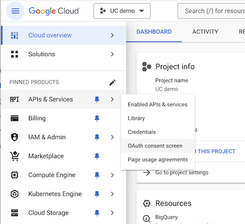
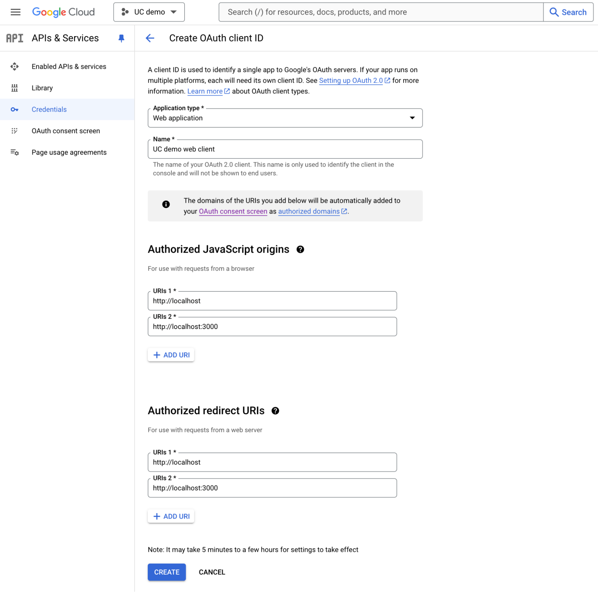
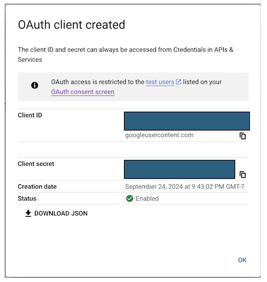

# Configure Google as the Identity Provider

To configure Google as your external identity provider, go to the
[Google Cloud Console Resource Manager](https://console.cloud.google.com/cloud-resource-manager) to create a new
project.

* Click on **Create Project** and name it (e.g, UC demo)

## Configure OAuth

* Go to your project, then select **APIs & Services \> OAuth consent screen**

    

* Choose **External** and then click **Create**.

## Configure App Information

* For the **App information** dialog, please provide the *App name*, *user-supported* *email*, and
    *Developer contact information* at a minimum.  Click **Save and Continue**.

* For the purpose of this demo, skip *Scopes,* *Test users*, and go directly to *Summary* return **Back to Dashboard**.

## Configure OAuth client ID

* Click **APIs & Services \> Credentials** and click the **Create Credentials** button to create an **OAuth client ID**.
    * **Application type**:  Web application
    * **Name**: UC demo web client
    * **Authorized JavaScript origins**: `http://localhost`, `http://localhost:3000` (this is required for the UI)
    * **Authorized redirect URIs**: `http://localhost`, `http://localhost:3000` (this is required for the UI)

    

## Obtain Client ID and client secret

* Once the OAuth client ID is created, a pop-up dialog box will appear containing the **Client ID** and
    **client secret**. Make sure to copy and/or download it (via the Download JSON button), as this will be needed in
    the following steps.

    
