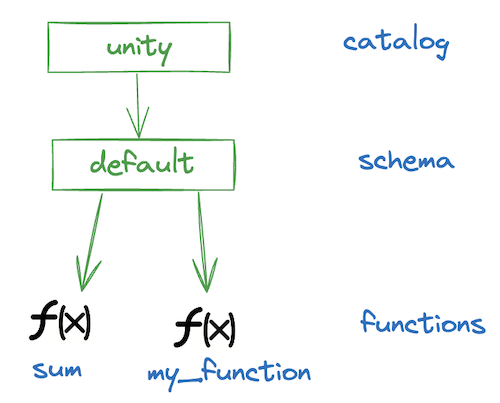

# Unity Catalog Functions

This page shows you how to use Unity Catalog to store, access and govern Functions.

Functions are units of saved logic that return a scalar value or a set of rows.

Using Unity Catalog to store your Functions is great for:

1. reusing code, and
2. applying permissions or filters.

The following diagram shows an example of a Unity Catalog instance with two functions: `sum` and `my_function`:



Let's look at how this works.

## Set Up

We'll use a local Unity Catalog server to get started. The default local UC server comes with some sample data.

> If this is your first time spinning up a UC server, you might want to check out the [Quickstart](../quickstart.md)
    first.

Spin up a local UC server by running the following code in a terminal from the root directory of your local
`unitycatalog` repository:

```sh
bin/start-uc-server
```

Now open a second terminal window to start working with your Unity Catalog instance.

## Inspecting Functions

You can list the functions in your UC namespace using:

```sh
bin/uc function list --catalog unity --schema default
```

You should see something that looks like:

```console
┌────────────┬────────┬────────┬────────┬────────┬────────┬────────┬────────┬────────┬────────┬────────┬────────┬────────┬────────┬────────┬────────┬────────┬────────┬────────┬────────┬────────┬────────┬────────┐
│    NAME    │CATALOG_│SCHEMA_N│INPUT_PA│DATA_TYP│FULL_DAT│RETURN_P│ROUTINE_│ROUTINE_│ROUTINE_│PARAMETE│IS_DETER│SQL_DATA│IS_NULL_│SECURITY│SPECIFIC│COMMENT │PROPERTI│FULL_NAM│CREATED_│UPDATED_│FUNCTION│EXTERNAL│
│            │  NAME  │  AME   │  RAMS  │   E    │ A_TYPE │ ARAMS  │  BODY  │DEFINITI│DEPENDEN│R_STYLE │MINISTIC│_ACCESS │  CALL  │ _TYPE  │ _NAME  │        │   ES   │   E    │   AT   │   AT   │  _ID   │_LANGUAG│
│            │        │        │        │        │        │        │        │   ON   │  CIES  │        │        │        │        │        │        │        │        │        │        │        │        │   E    │
├────────────┼────────┼────────┼────────┼────────┼────────┼────────┼────────┼────────┼────────┼────────┼────────┼────────┼────────┼────────┼────────┼────────┼────────┼────────┼────────┼────────┼────────┼────────┤
│sum         │unity   │default │{"par...│INT     │INT     │null    │EXTERNAL│t = x...│null    │S       │true    │NO_SQL  │false   │DEFINER │sum     │Adds ...│null    │unity...│17183...│null    │8e83e...│python  │
├────────────┼────────┼────────┼────────┼────────┼────────┼────────┼────────┼────────┼────────┼────────┼────────┼────────┼────────┼────────┼────────┼────────┼────────┼────────┼────────┼────────┼────────┼────────┤
│lowercase   │unity   │default │{"par...│STRING  │STRING  │null    │EXTERNAL│g = s...│null    │S       │true    │NO_SQL  │false   │DEFINER │lower...│Conve...│null    │unity...│17183...│null    │33d81...│python  │
└────────────┴────────┴────────┴────────┴────────┴────────┴────────┴────────┴────────┴────────┴────────┴────────┴────────┴────────┴────────┴────────┴────────┴────────┴────────┴────────┴────────┴────────┴────────┘
```

You can get the metadata of one of these functions using:

```sh
bin/uc function get --full_name unity.default.sum
```

You should see something that looks like:

```console
┌────────────────────┬────────────────────────────────────────────────────────────────────────────────────────────────────┐
│        KEY         │                                               VALUE                                                │
├────────────────────┼────────────────────────────────────────────────────────────────────────────────────────────────────┤
│NAME                │sum                                                                                                 │
├────────────────────┼────────────────────────────────────────────────────────────────────────────────────────────────────┤
│CATALOG_NAME        │unity                                                                                               │
├────────────────────┼────────────────────────────────────────────────────────────────────────────────────────────────────┤
│SCHEMA_NAME         │default                                                                                             │
├────────────────────┼────────────────────────────────────────────────────────────────────────────────────────────────────┤
│INPUT_PARAMS        │{"parameters":[{"name":"x","type_text":"int","type_json":"{\"name\":\"x\",\"type\":\"integer\",\"nul│
│                    │lable\":false,\"metadata\":{}}","type_name":"INT","type_precision":null,"type_scale":null,"type_inte│
│                    │rval_type":null,"position":0,"parameter_mode":"IN","parameter_type":"PARAM","parameter_default":null│
│                    │,"comment":null},{"name":"y","type_text":"int","type_json":"{\"name\":\"y\",\"type\":\"integer\",\"n│
│                    │ullable\":false,\"metadata\":{}}","type_name":"INT","type_precision":null,"type_scale":null,"type_in│
│                    │terval_type":null,"position":1,"parameter_mode":"IN","parameter_type":"PARAM","parameter_default":nu│
│                    │ll,"comment":null},{"name":"z","type_text":"int","type_json":"{\"name\":\"z\",\"type\":\"integer\",\│
│                    │"nullable\":false,\"metadata\":{}}","type_name":"INT","type_precision":null,"type_scale":null,"type_│
│                    │interval_type":null,"position":2,"parameter_mode":"IN","parameter_type":"PARAM","parameter_default":│
│                    │null,"comment":null}]}                                                                              │
├────────────────────┼────────────────────────────────────────────────────────────────────────────────────────────────────┤
│DATA_TYPE           │INT                                                                                                 │
├────────────────────┼────────────────────────────────────────────────────────────────────────────────────────────────────┤
│FULL_DATA_TYPE      │INT                                                                                                 │
├────────────────────┼────────────────────────────────────────────────────────────────────────────────────────────────────┤
│RETURN_PARAMS       │null                                                                                                │
├────────────────────┼────────────────────────────────────────────────────────────────────────────────────────────────────┤
│ROUTINE_BODY        │EXTERNAL                                                                                            │
├────────────────────┼────────────────────────────────────────────────────────────────────────────────────────────────────┤
│ROUTINE_DEFINITION  │t = x + y + z\nreturn t                                                                             │
├────────────────────┼────────────────────────────────────────────────────────────────────────────────────────────────────┤
│ROUTINE_DEPENDENCIES│null                                                                                                │
├────────────────────┼────────────────────────────────────────────────────────────────────────────────────────────────────┤
│PARAMETER_STYLE     │S                                                                                                   │
├────────────────────┼────────────────────────────────────────────────────────────────────────────────────────────────────┤
│IS_DETERMINISTIC    │true                                                                                                │
├────────────────────┼────────────────────────────────────────────────────────────────────────────────────────────────────┤
│SQL_DATA_ACCESS     │NO_SQL                                                                                              │
├────────────────────┼────────────────────────────────────────────────────────────────────────────────────────────────────┤
│IS_NULL_CALL        │false                                                                                               │
├────────────────────┼────────────────────────────────────────────────────────────────────────────────────────────────────┤
│SECURITY_TYPE       │DEFINER                                                                                             │
├────────────────────┼────────────────────────────────────────────────────────────────────────────────────────────────────┤
│SPECIFIC_NAME       │sum                                                                                                 │
├────────────────────┼────────────────────────────────────────────────────────────────────────────────────────────────────┤
│COMMENT             │Adds two numbers.                                                                                   │
├────────────────────┼────────────────────────────────────────────────────────────────────────────────────────────────────┤
│PROPERTIES          │null                                                                                                │
├────────────────────┼────────────────────────────────────────────────────────────────────────────────────────────────────┤
│FULL_NAME           │unity.default.sum                                                                                   │
├────────────────────┼────────────────────────────────────────────────────────────────────────────────────────────────────┤
│CREATED_AT          │1718315581372                                                                                       │
├────────────────────┼────────────────────────────────────────────────────────────────────────────────────────────────────┤
│UPDATED_AT          │null                                                                                                │
├────────────────────┼────────────────────────────────────────────────────────────────────────────────────────────────────┤
│FUNCTION_ID         │8e83e2d9-e523-46a1-b69c-8fe9212f1057                                                                │
├────────────────────┼────────────────────────────────────────────────────────────────────────────────────────────────────┤
│EXTERNAL_LANGUAGE   │python                                                                                              │
└────────────────────┴────────────────────────────────────────────────────────────────────────────────────────────────────┘
```

The `routine definition` is probably most helpful here: `t = x + y + z\nreturn t`

It looks like this functions takes in 3 arguments and returns their sum. The `DATA_TYPE` field tells us that the
output should be of `INT` data type.

## Calling Functions from Unity Catalog

Let's try calling this function.

We'll use `function call` to reference the Function by its full name and pass 3 input parameters:

```sh
bin/uc function call --full_name unity.default.sum --input_params "1,2,3"
```

This should return:

`6`

Nicely done! You have called a Function stored in your Unity Catalog.

## Adding Functions to Unity Catalog

Let's create a new function and add it to your Unity Catalog.

We'll start with a basic example using only scalar values.

Suppose you want to register the following function to Unity Catalog: `c = a * b`

To do so, define a new Function by its full name, specify the data type of the output, the input parameters and their
data types, and define the function.

```sh
bin/uc function create --full_name unity.default.my_function \
--data_type INT --input_params "a int, b int" --def "c=a*b\nreturn c"
```

This should output something like:

```sh
┌────────────────────┬────────────────────────────────────────────────────────────────────────────────────────────────────┐
│        KEY         │                                               VALUE                                                │
├────────────────────┼────────────────────────────────────────────────────────────────────────────────────────────────────┤
│NAME                │myFunction                                                                                          │
├────────────────────┼────────────────────────────────────────────────────────────────────────────────────────────────────┤
│CATALOG_NAME        │unity                                                                                               │
├────────────────────┼────────────────────────────────────────────────────────────────────────────────────────────────────┤
│SCHEMA_NAME         │default                                                                                             │
├────────────────────┼────────────────────────────────────────────────────────────────────────────────────────────────────┤
│INPUT_PARAMS        │{"parameters":[{"name":"a","type_text":"int","type_json":"{\"name\":\"a\",\"type\":\"integer\",\"nul│
│                    │lable\":true,\"metadata\":{}}","type_name":"INT","type_precision":null,"type_scale":null,"type_inter│
│                    │val_type":null,"position":0,"parameter_mode":null,"parameter_type":null,"parameter_default":null,"co│
│                    │mment":null},{"name":"b","type_text":"int","type_json":"{\"name\":\"b\",\"type\":\"integer\",\"nulla│
│                    │ble\":true,\"metadata\":{}}","type_name":"INT","type_precision":null,"type_scale":null,"type_interva│
│                    │l_type":null,"position":1,"parameter_mode":null,"parameter_type":null,"parameter_default":null,"comm│
│                    │ent":null}]}                                                                                        │
├────────────────────┼────────────────────────────────────────────────────────────────────────────────────────────────────┤
│DATA_TYPE           │INT                                                                                                 │
├────────────────────┼────────────────────────────────────────────────────────────────────────────────────────────────────┤
│FULL_DATA_TYPE      │INT                                                                                                 │
├────────────────────┼────────────────────────────────────────────────────────────────────────────────────────────────────┤
│RETURN_PARAMS       │null                                                                                                │
├────────────────────┼────────────────────────────────────────────────────────────────────────────────────────────────────┤
│ROUTINE_BODY        │EXTERNAL                                                                                            │
├────────────────────┼────────────────────────────────────────────────────────────────────────────────────────────────────┤
│ROUTINE_DEFINITION  │c=a*b\nreturn c                                                                                     │
├────────────────────┼────────────────────────────────────────────────────────────────────────────────────────────────────┤
│ROUTINE_DEPENDENCIES│null                                                                                                │
├────────────────────┼────────────────────────────────────────────────────────────────────────────────────────────────────┤
│PARAMETER_STYLE     │S                                                                                                   │
├────────────────────┼────────────────────────────────────────────────────────────────────────────────────────────────────┤
│IS_DETERMINISTIC    │true                                                                                                │
├────────────────────┼────────────────────────────────────────────────────────────────────────────────────────────────────┤
│SQL_DATA_ACCESS     │NO_SQL                                                                                              │
├────────────────────┼────────────────────────────────────────────────────────────────────────────────────────────────────┤
│IS_NULL_CALL        │true                                                                                                │
├────────────────────┼────────────────────────────────────────────────────────────────────────────────────────────────────┤
│SECURITY_TYPE       │DEFINER                                                                                             │
├────────────────────┼────────────────────────────────────────────────────────────────────────────────────────────────────┤
│SPECIFIC_NAME       │myFunction                                                                                          │
├────────────────────┼────────────────────────────────────────────────────────────────────────────────────────────────────┤
│COMMENT             │null                                                                                                │
├────────────────────┼────────────────────────────────────────────────────────────────────────────────────────────────────┤
│PROPERTIES          │null                                                                                                │
├────────────────────┼────────────────────────────────────────────────────────────────────────────────────────────────────┤
│FULL_NAME           │unity.default.myFunction                                                                            │
├────────────────────┼────────────────────────────────────────────────────────────────────────────────────────────────────┤
│CREATED_AT          │1720516826170                                                                                       │
├────────────────────┼────────────────────────────────────────────────────────────────────────────────────────────────────┤
│UPDATED_AT          │null                                                                                                │
├────────────────────┼────────────────────────────────────────────────────────────────────────────────────────────────────┤
│FUNCTION_ID         │012545ee-2a89-4534-b8e9-f41b09f4b2eb                                                                │
├────────────────────┼────────────────────────────────────────────────────────────────────────────────────────────────────┤
│EXTERNAL_LANGUAGE   │python                                                                                              │
└────────────────────┴────────────────────────────────────────────────────────────────────────────────────────────────────┘
```

You can also store more complex functions. For example, you can import Python modules and use them in your function.
Note if you have multiple lines in complex functions, you must insert "\n" to separate lines in the function
definition. Otherwise, the function will return "invalid syntax" error when it is called.

Let's take the example below of a function that uses the Numpy library to simulate a random roll of dice:

```python
def myPythonFunction(n_sides, n_dice):
    import numpy as np
    rolls=np.random.randint(1, n_sides + 1, size=n_dice)
    return print(rolls)"
```

You can register this function to your Unity Catalog as follows:

```sh
bin/uc function create --full_name unity.default.myPythonFunction --data_type INT --input_params "n_sides int, n_dice int" --language "python" --def "import numpy as np\nrolls=np.random.randint(1, n_sides + 1, size=n_dice)\nreturn print(rolls)"
```

And then call it with:

```sh
bin/uc function call --full_name unity.default.myPythonFunction --input_params "6,1"
```

This will simulate rolling a single die with 6 sides.

### Function Create Parameters

`function create` takes the following parameters:

Required Parameters:

- `--full_name`: The full name of the table. The full name is the concatenation of the catalog name, schema name, and
    table/volume name separated by a dot. For example, catalog_name.schema_name.table_name.
- `--input_params`: The input parameters of the function,
- `--data_type`: The data type of the function.

Optional Parameters:

- `--comment`: Comment/Description of the entity.
- `--def`: The routine definition of the function
- `--language`: The language of the function, currently only "python" is supported.
