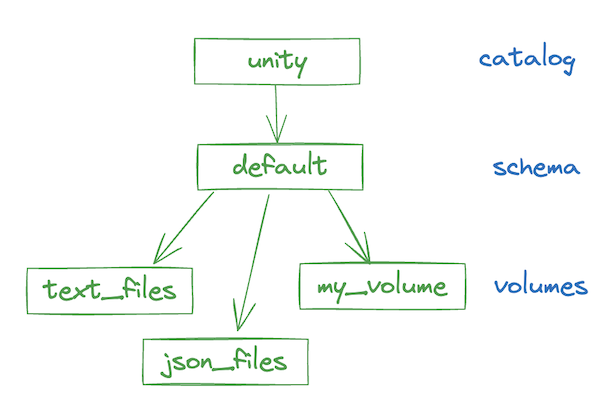
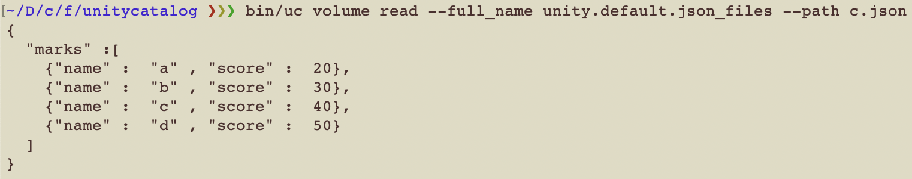
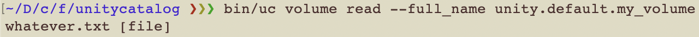

# Unity Catalog Volumes

Unity Catalog volumes are good for registering datasets that are non-tabular or not supported as Unity Catalog tables.

Unity Catalog volumes are a great option for JSON files, text files, or Lance datasets.

Here's an example of a schema that contains three volumes:



## Basic Unity Catalog volume operations

Let's list the volumes.

```sh
bin/uc volume list --catalog unity --schema default
```


You should see a few volumes. Let's get the metadata of one of those volumes.

```sh
bin/uc volume get --full_name unity.default.json_files
```


Now let's list the directories/files in this volume.

```sh
bin/uc volume read --full_name unity.default.json_files
```


You should see two JSON files listed and one directory. Let's view the contents of one file.

```sh
bin/uc volume read --full_name unity.default.json_files --path c.json
```



Voilà! You have read the content of a file stored in a volume. We can also list the contents of any subdirectory.
For example:

```sh
bin/uc volume read --full_name unity.default.json_files --path dir1
```

Now let's try creating a new external volume. First physically create a directory with some files in it.

For example, create a directory `/tmp/my_volume` and put some files in it.  Then create the volume in UC.

```sh
bin/uc volume create --full_name unity.default.my_volume \
--storage_location /tmp/my_volume
```

Add a file to the volume:

```sh
mkdir /tmp/my_volume
touch /tmp/my_volume/whatever.txt
```

Now you can see the contents of this volume.

```sh
bin/uc volume read --full_name unity.default.my_volume
```


