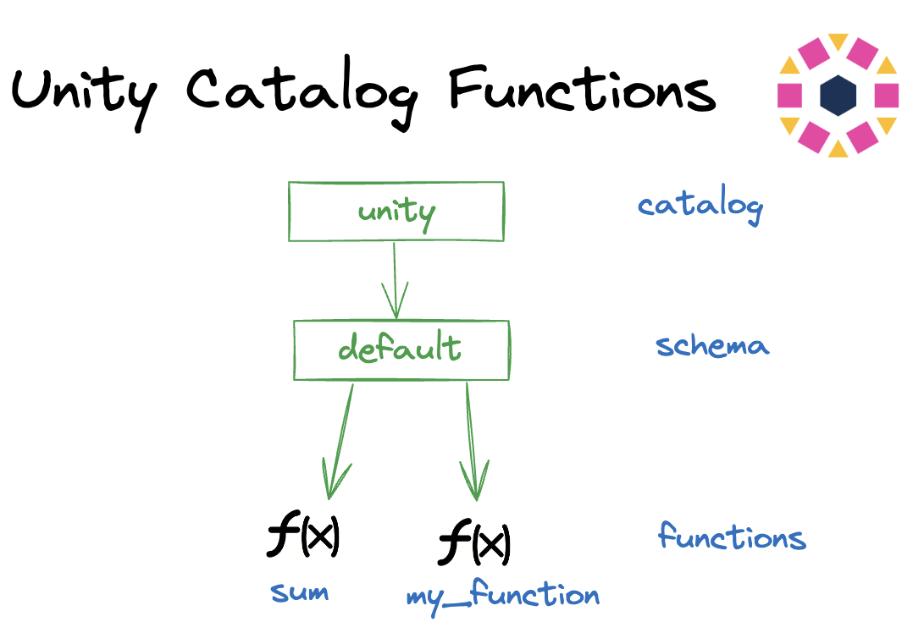
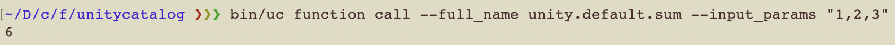
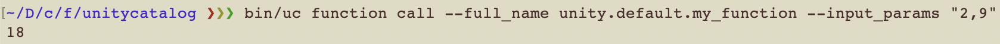

# Unity Catalog Functions

You can register functions in Unity Catalog schemas.

Persisting functions is good for reusing code and applying permissions or filters.

The following diagram shows an example of a Unity Catalog instance with two functions: `sum` and `my_function`:



**Display functions**

Let's list the functions.

```sh
bin/uc function list --catalog unity --schema default
```

You should see a few functions. Let's get the metadata of one of these functions.

```sh
bin/uc function get --full_name unity.default.sum
```


In the printed metadata, pay attention to the columns `input_parameters`, `external_language`, and `routine_definition`.

This seems like a simple python function that takes 3 arguments and returns the sum of them. Let's try calling this function.

Behind the scenes, the invocation of the function is achieved by calling the python script at `etc/data/function/python_engine.py` with the function name and arguments.

```sh
bin/uc function call --full_name unity.default.sum --input_params "1,2,3"
```



Voila! You have invoked a function stored in UC. 

**Create function**

Let's try and create a new function.

```sh
bin/uc function create --full_name unity.default.my_function \
--data_type INT --input_params "a int, b int" --def "c=a*b\nreturn c"
```

You can test out the newly created function by invoking it.

```sh
bin/uc function call --full_name unity.default.my_function --input_params "2,9"
```


