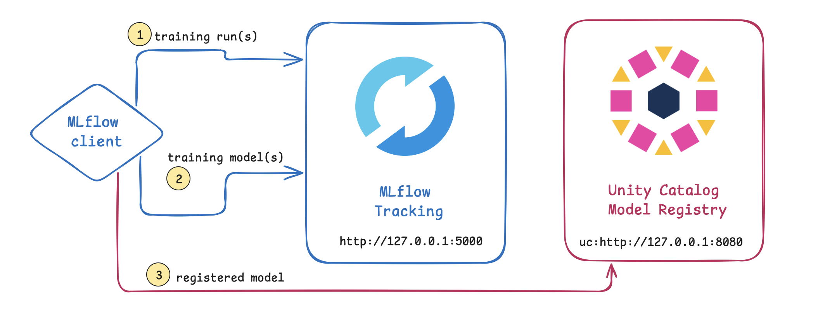
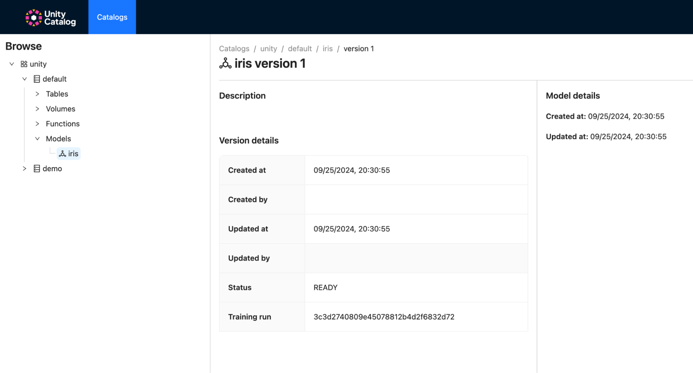
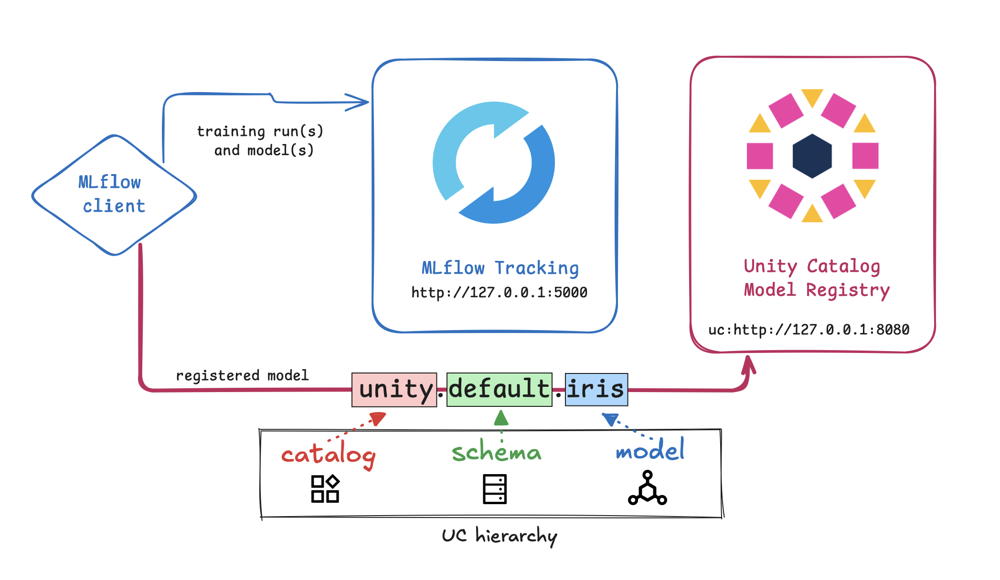

# Unity Catalog Registered Models and Model Versions

This page shows you how to use Unity Catalog to store, access, and govern Registered Models and Model Versions.

Registered Models are logical containers for ML models within Unity Catalog.  A registered model is comprised of any
number of Model Versions which represent different iterations of the model that you with to keep track of from within
Unity Catalog.

## How Unity Catalog and MLflow work together

The following diagram shows how Unity Catalog and MLflow work together from tracking to governance.



The MLflow client connects both MLflow and Unity Catalog services (via `port:5000` and `port:8080` respectively).

1. When you are running your training runs with MLflow, the metrics generated in those training runs are stored within
    MLflow.
2. For those same training runs, models are often generated, and those models are also stored within MLflow.
3. Once you have decided which model you want to register, you can register and store that model into Unity Catalog.

## Setting up MLflow and Unity Catalog

!!! warning "Prerequisites"
    For Unity Catalog MLflow Integration, ensure you are using MLflow version >= 2.16.1 and Unity Catalog >= 0.2.

### Spin up Unity Catalog

We will use a local Unity Catalog server to get started.

!!! question "First time working with Unity Catalog?"
     If this is your first time spinning up a UC server, you might want to check out the
    [Quickstart](../quickstart.md) first.

Spin up a local UC server by running the following code in a terminal from the root directory of your local
`unitycatalog` repository:

```sh
bin/start-uc-server
```

### Install (or upgrade) MLflow

```sh
pip install mlflow
```

The installation of MLflow includes the MLflow CLI tool, so you can start a local MLflow server with UI by running the
command below in your terminal:

```sh
mlflow ui
```

It will generate logs with the IP address of the newly started tracking server which can be used in your MLflow Python
workloads, for example:

```py
import mlflow

mlflow.set_tracking_uri("http://127.0.0.1:5000") # (1)
mlflow.set_registry_uri("uc:http://127.0.0.1:8080") # (2)
```

1. Here we are specifying the MLflow tracking server to store training metrics and models.
2. Here we are specifying that we register our ML model in Unity Catalog.

At this point, your MLflow environment is ready for use with the newly started MLflow tracking server and the
Unity Catalog server acting as your model registry.

You can quickly train a test model and validate that the Unity Catalog MLflow integration is fully working.

## Train and register a sample model

The following code snippet creates a scikit-learn model and registers the model into Unity Catalog.

```py
import os
from sklearn import datasets
from sklearn.ensemble import RandomForestClassifier
from sklearn.model_selection import train_test_split
import pandas as pd

X, y = datasets.load_iris(return_X_y=True, as_frame=True)
X_train, X_test, y_train, y_test = train_test_split(X, y, test_size=0.2, random_state=42)

with mlflow.start_run():
    # Train a sklearn model on the iris dataset
    clf = RandomForestClassifier(max_depth=7) 
    clf.fit(X_train, y_train) # (1)

    # Take the first row of the training dataset as the model input example.
    input_example = X_train.iloc[[0]]

    # Log the model and register it as a new version in UC.
    mlflow.sklearn.log_model(
        sk_model=clf,
        artifact_path="model", # (2)

        # The signature is automatically inferred from the input example
        # and its predicted output.
        input_example=input_example,
        registered_model_name="unity.default.iris", # (3)
    )
```

1. `clf` is a Random Forest Classifier and it is being trained from training data (`X_train`, `Y_train`) from the Iris
    dataset.
2. The `artifact_path` contains the model we just trained and it is common to have multiple training runs with
    multiple models generated and stored with MLflow.
3. Because we had earlier specified `mlflow.set_registry_uri("uc:http://127.0.0.1:8080")`, the MLflow client will
    register the model to Unity Catalog.

Upon successful registration of the model, you should see the following output.

```sh
Successfully registered model 'unity.default.iris'.
2024/09/24 20:51:29 INFO mlflow.store.model_registry.abstract_store: Waiting up to 300 seconds for model version to finish creation. Model name: unity.default.iris, version 1
Created version '1' of model 'unity.default.iris'.
<mlflow.models.model.ModelInfo object at 0x13ffb2e80>
2024/09/24 20:51:29 INFO mlflow.tracking._tracking_service.client: 🏃 View run glamorous-gnu-508 at: http://127.0.0.1:5000/#/experiments/0/runs/b3ab03114a4b4b869f3d30070ffc8a1f.
2024/09/24 20:51:29 INFO mlflow.tracking._tracking_service.client: 🧪 View experiment at: http://127.0.0.1:5000/#/experiments/0.
```

The results can be seen in the Unity Catalog UI at [http://localhost:3000](http://localhost:3000). For more
information, dive deeper into the [Unity Catalog UI](./ui.md).  



---

As you can see in the UI, there is an implied hierarchy of a three-part naming convention within Unity Catalog that is
applicable to data and AI assets. The hierarchy of `catalog -> schema -> asset` plays out as the `unity` catalog,
`default` schema, and `iris` asset (in this case ML model).  



This convention allows us to apply governance to these assets (e.g., models, tables, volumes, and functions) in a
similar fashion. You can also see the training run(s) and model(s) in the MLflow UI at
[http://127.0.0.1:5000/](http://127.0.0.1:5000/).  


---

!!! note "MLflow Guides"
    Please see the [MLflow quickstart guides](https://mlflow.org/docs/latest/getting-started/index.html) and the
    [MLflow python API](https://mlflow.org/docs/latest/python_api/index.html) to learn how to use the MLflow client to
    train, register, and use models from with the Unity Catalog server.

## Load the sample model

In a new terminal, you can load your recently registered model using the following code snippet.

```py
from sklearn import datasets
from sklearn.ensemble import RandomForestClassifier
from sklearn.model_selection import train_test_split
import pandas as pd

import mlflow
import mlflow.sklearn
from mlflow.models import infer_signature

mlflow.set_tracking_uri("http://127.0.0.1:5000")
mlflow.set_registry_uri("uc:http://127.0.0.1:8080") # (1)

X, y = datasets.load_iris(return_X_y=True, as_frame=True)
X_train, X_test, y_train, y_test = train_test_split(X, y, test_size=0.2, random_state=42)

# Load model
loaded_model = mlflow.pyfunc.load_model(f"models:/unity.default.iris/1") # (2)
predictions = loaded_model.predict(X_test)
iris_feature_names = datasets.load_iris().feature_names
result = pd.DataFrame(X_test, columns=iris_feature_names)
result["actual_class"] = y_test
result["predicted_class"] = predictions
result[:4]
```

1. Here we are specifying that we are loading our ML model from Unity Catalog.
2. We are loading the ML model `unity.default.iris`, version `1` from the Unity Catalog model registry.

This code snippet uses the `unity.default.iris` model to predict the class (`predicted_class`) using the test dataset
(`X_test`) and compares it to the actual class (`actual_class`) from the Iris dataset.

```sh
     sepal length (cm)  sepal width (cm)  petal length (cm)  petal width (cm)  actual_class  predicted_class
73                 6.1               2.8                4.7               1.2             1                1
18                 5.7               3.8                1.7               0.3             0                0
118                7.7               2.6                6.9               2.3             2                2
78                 6.0               2.9                4.5               1.5             1                1
```

!!! tip
    The UC CLI also has support for interacting with models in the Unity Catalog server. It is recommended that you
    interact with models in Unity Catalog using the MLflow client.

## Inspecting Registered Models and Model Versions

You can list the registered models in your UC namespace using:

```sh title="List registered models"
bin/uc registered_model list --catalog unity --schema default
```

You should see something that looks like:

```console
┌──────────┬───────────────────┬───────────────────┬───────────────────┬───────────────────┬───────────────────┬───────────────────┬───────────────────┬───────────────────┬───────────────────┬────────────────────────────────────┐
│   NAME   │   CATALOG_NAME    │    SCHEMA_NAME    │ STORAGE_LOCATION  │     FULL_NAME     │      COMMENT      │    CREATED_AT     │    CREATED_BY     │    UPDATED_AT     │    UPDATED_BY     │              MODEL_ID              │
├──────────┼───────────────────┼───────────────────┼───────────────────┼───────────────────┼───────────────────┼───────────────────┼───────────────────┼───────────────────┼───────────────────┼────────────────────────────────────┤
│iris      │unity              │default            │file:/tmp/uc-roo...│unity.default.ir...│null               │1725398516483      │null               │1725398516483      │null               │2ea060a1-2315-490f-8edf-5f6419392de6│
└──────────┴───────────────────┴───────────────────┴───────────────────┴───────────────────┴───────────────────┴───────────────────┴───────────────────┴───────────────────┴───────────────────┴────────────────────────────────────┘
```

Additionally, you can list the model versions under a registered model using:

```sh title="List model versions"
bin/uc model_version list --full_name unity.default.iris
```

You should see something that looks like this when listing model versions:

```console
┌──────────────┬──────────────┬──────────────┬──────────────┬──────────────┬──────┬──────────────┬──────────────┬──────────────┬──────────────┬──────────────┬──────────────┬──────────────┬────────────────────────────────────┐
│  MODEL_NAME  │ CATALOG_NAME │ SCHEMA_NAME  │   VERSION    │    SOURCE    │RUN_ID│    STATUS    │STORAGE_LOCATI│   COMMENT    │  CREATED_AT  │  CREATED_BY  │  UPDATED_AT  │  UPDATED_BY  │          MODEL_VERSION_ID          │
│              │              │              │              │              │      │              │      ON      │              │              │              │              │              │                                    │
├──────────────┼──────────────┼──────────────┼──────────────┼──────────────┼──────┼──────────────┼──────────────┼──────────────┼──────────────┼──────────────┼──────────────┼──────────────┼────────────────────────────────────┤
│iris          │unity         │default       │1             │my_source     │my_id │PENDING_REG...│file:/tmp/u...│Model         │1725847699924 │null          │1725847699924 │null          │a61c624f-206a-419b-b065-65acf5f1b8f9│
└──────────────┴──────────────┴──────────────┴──────────────┴──────────────┴──────┴──────────────┴──────────────┴──────────────┴──────────────┴──────────────┴──────────────┴──────────────┴────────────────────────────────────┘
```

You can get the metadata of registered models or model versions using

```sh title="View registered model metadata"
bin/uc registered_model get --full_name unity.default.iris
```

which would return something similar to this:

```console
┌──────────────────────────────────────┬──────────────────────────────────────────────────────────────────────────────────────────────────────────────────────────────────────┐
│                 KEY                  │                                                                VALUE                                                                 │
├──────────────────────────────────────┼──────────────────────────────────────────────────────────────────────────────────────────────────────────────────────────────────────┤
│NAME                                  │iris                                                                                                                                  │
├──────────────────────────────────────┼──────────────────────────────────────────────────────────────────────────────────────────────────────────────────────────────────────┤
│CATALOG_NAME                          │unity                                                                                                                                 │
├──────────────────────────────────────┼──────────────────────────────────────────────────────────────────────────────────────────────────────────────────────────────────────┤
│SCHEMA_NAME                           │default                                                                                                                               │
├──────────────────────────────────────┼──────────────────────────────────────────────────────────────────────────────────────────────────────────────────────────────────────┤
│STORAGE_LOCATION                      │file:/tmp/ucroot/f029b870-9468-4f10-badc-630b41e5690d/b08dfd57-a939-46cf-b102-9b906b884fae/models/a4f296f1-94a9-4820-bf0d-d16d77a65f4f│
├──────────────────────────────────────┼──────────────────────────────────────────────────────────────────────────────────────────────────────────────────────────────────────┤
│FULL_NAME                             │unity.default.iris                                                                                                                    │
├──────────────────────────────────────┼──────────────────────────────────────────────────────────────────────────────────────────────────────────────────────────────────────┤
│COMMENT                               │null                                                                                                                                  │
├──────────────────────────────────────┼──────────────────────────────────────────────────────────────────────────────────────────────────────────────────────────────────────┤
│CREATED_AT                            │1725848194737                                                                                                                         │
├──────────────────────────────────────┼──────────────────────────────────────────────────────────────────────────────────────────────────────────────────────────────────────┤
│CREATED_BY                            │null                                                                                                                                  │
├──────────────────────────────────────┼──────────────────────────────────────────────────────────────────────────────────────────────────────────────────────────────────────┤
│UPDATED_AT                            │1725848194737                                                                                                                         │
├──────────────────────────────────────┼──────────────────────────────────────────────────────────────────────────────────────────────────────────────────────────────────────┤
│UPDATED_BY                            │null                                                                                                                                  │
├──────────────────────────────────────┼──────────────────────────────────────────────────────────────────────────────────────────────────────────────────────────────────────┤
│MODEL_ID                              │a4f296f1-94a9-4820-bf0d-d16d77a65f4f                                                                                                  │
└──────────────────────────────────────┴──────────────────────────────────────────────────────────────────────────────────────────────────────────────────────────────────────┘
```

or

```sh title="View model version metadata"
bin/uc model_version get --full_name unity.default.iris --version 1
```

which would return something similar to:

```console
┌──────────────────────────────────────┬─────────────────────────────────────────────────────────────────────────────────────────────────────────────────────────────────────────────────────────────────────────────┐
│                 KEY                  │                                                                                    VALUE                                                                                    │
├──────────────────────────────────────┼─────────────────────────────────────────────────────────────────────────────────────────────────────────────────────────────────────────────────────────────────────────────┤
│MODEL_NAME                            │iris                                                                                                                                                                         │
├──────────────────────────────────────┼─────────────────────────────────────────────────────────────────────────────────────────────────────────────────────────────────────────────────────────────────────────────┤
│CATALOG_NAME                          │unity                                                                                                                                                                        │
├──────────────────────────────────────┼─────────────────────────────────────────────────────────────────────────────────────────────────────────────────────────────────────────────────────────────────────────────┤
│SCHEMA_NAME                           │default                                                                                                                                                                      │
├──────────────────────────────────────┼─────────────────────────────────────────────────────────────────────────────────────────────────────────────────────────────────────────────────────────────────────────────┤
│VERSION                               │1                                                                                                                                                                            │
├──────────────────────────────────────┼─────────────────────────────────────────────────────────────────────────────────────────────────────────────────────────────────────────────────────────────────────────────┤
│SOURCE                                │my_source                                                                                                                                                                    │
├──────────────────────────────────────┼─────────────────────────────────────────────────────────────────────────────────────────────────────────────────────────────────────────────────────────────────────────────┤
│RUN_ID                                │my_id                                                                                                                                                                        │
├──────────────────────────────────────┼─────────────────────────────────────────────────────────────────────────────────────────────────────────────────────────────────────────────────────────────────────────────┤
│STATUS                                │PENDING_REGISTRATION                                                                                                                                                         │
├──────────────────────────────────────┼─────────────────────────────────────────────────────────────────────────────────────────────────────────────────────────────────────────────────────────────────────────────┤
│STORAGE_LOCATION                      │file:/tmp/ucroot/f029b870-9468-4f10-badc-630b41e5690d/b08dfd57-a939-46cf-b102-9b906b884fae/models/a4f296f1-94a9-4820-bf0d-d16d77a65f4f/versions/a61c624f-206a-419b-b065-65acf│
│                                      │5f1b8f9                                                                                                                                                                      │
├──────────────────────────────────────┼─────────────────────────────────────────────────────────────────────────────────────────────────────────────────────────────────────────────────────────────────────────────┤
│COMMENT                               │Model                                                                                                                                                                        │
├──────────────────────────────────────┼─────────────────────────────────────────────────────────────────────────────────────────────────────────────────────────────────────────────────────────────────────────────┤
│CREATED_AT                            │1725847699924                                                                                                                                                                │
├──────────────────────────────────────┼─────────────────────────────────────────────────────────────────────────────────────────────────────────────────────────────────────────────────────────────────────────────┤
│CREATED_BY                            │null                                                                                                                                                                         │
├──────────────────────────────────────┼─────────────────────────────────────────────────────────────────────────────────────────────────────────────────────────────────────────────────────────────────────────────┤
│UPDATED_AT                            │1725847699924                                                                                                                                                                │
├──────────────────────────────────────┼─────────────────────────────────────────────────────────────────────────────────────────────────────────────────────────────────────────────────────────────────────────────┤
│UPDATED_BY                            │null                                                                                                                                                                         │
├──────────────────────────────────────┼─────────────────────────────────────────────────────────────────────────────────────────────────────────────────────────────────────────────────────────────────────────────┤
│MODEL_VERSION_ID                      │a61c624f-206a-419b-b065-65acf5f1b8f9                                                                                                                                         │
└──────────────────────────────────────┴─────────────────────────────────────────────────────────────────────────────────────────────────────────────────────────────────────────────────────────────────────────────┘
```

## Updating registered models and model versions

You can update the comment or name of a registered models using the Unity Catalog CLI.

```sh title="Comment a registered model"
bin/uc registered_model update --full_name unity.default.iris --new_name iris2 --comment "new comment"
```

which will return the updated metadata of the registered model:

```console
┌──────────────────────────────────────┬──────────────────────────────────────────────────────────────────────────────────────────────────────────────────────────────────────┐
│                 KEY                  │                                                                VALUE                                                                 │
├──────────────────────────────────────┼──────────────────────────────────────────────────────────────────────────────────────────────────────────────────────────────────────┤
│NAME                                  │iris2                                                                                                                                 │
├──────────────────────────────────────┼──────────────────────────────────────────────────────────────────────────────────────────────────────────────────────────────────────┤
│CATALOG_NAME                          │unity                                                                                                                                 │
├──────────────────────────────────────┼──────────────────────────────────────────────────────────────────────────────────────────────────────────────────────────────────────┤
│SCHEMA_NAME                           │default                                                                                                                               │
├──────────────────────────────────────┼──────────────────────────────────────────────────────────────────────────────────────────────────────────────────────────────────────┤
│STORAGE_LOCATION                      │file:/tmp/ucroot/f029b870-9468-4f10-badc-630b41e5690d/b08dfd57-a939-46cf-b102-9b906b884fae/models/a4f296f1-94a9-4820-bf0d-d16d77a65f4f│
├──────────────────────────────────────┼──────────────────────────────────────────────────────────────────────────────────────────────────────────────────────────────────────┤
│FULL_NAME                             │unity.default.iris2                                                                                                                   │
├──────────────────────────────────────┼──────────────────────────────────────────────────────────────────────────────────────────────────────────────────────────────────────┤
│COMMENT                               │new comment                                                                                                                           │
├──────────────────────────────────────┼──────────────────────────────────────────────────────────────────────────────────────────────────────────────────────────────────────┤
│CREATED_AT                            │1725848194737                                                                                                                         │
├──────────────────────────────────────┼──────────────────────────────────────────────────────────────────────────────────────────────────────────────────────────────────────┤
│CREATED_BY                            │null                                                                                                                                  │
├──────────────────────────────────────┼──────────────────────────────────────────────────────────────────────────────────────────────────────────────────────────────────────┤
│UPDATED_AT                            │1725848487645                                                                                                                         │
├──────────────────────────────────────┼──────────────────────────────────────────────────────────────────────────────────────────────────────────────────────────────────────┤
│UPDATED_BY                            │null                                                                                                                                  │
├──────────────────────────────────────┼──────────────────────────────────────────────────────────────────────────────────────────────────────────────────────────────────────┤
│MODEL_ID                              │a4f296f1-94a9-4820-bf0d-d16d77a65f4f                                                                                                  │
└──────────────────────────────────────┴──────────────────────────────────────────────────────────────────────────────────────────────────────────────────────────────────────┘
```

Additionally, you can update the comment of a model version as well:

```sh title="Comment a model version"
bin/uc model_version --full_name unity.default.iris2 --version 1 --comment "New model version comment"
```

which will return the updated model version metadata:

```console
┌──────────────────────────────────────┬─────────────────────────────────────────────────────────────────────────────────────────────────────────────────────────────────────────────────────────────────────────────┐
│                 KEY                  │                                                                                    VALUE                                                                                    │
├──────────────────────────────────────┼─────────────────────────────────────────────────────────────────────────────────────────────────────────────────────────────────────────────────────────────────────────────┤
│MODEL_NAME                            │iris2                                                                                                                                                                        │
├──────────────────────────────────────┼─────────────────────────────────────────────────────────────────────────────────────────────────────────────────────────────────────────────────────────────────────────────┤
│CATALOG_NAME                          │unity                                                                                                                                                                        │
├──────────────────────────────────────┼─────────────────────────────────────────────────────────────────────────────────────────────────────────────────────────────────────────────────────────────────────────────┤
│SCHEMA_NAME                           │default                                                                                                                                                                      │
├──────────────────────────────────────┼─────────────────────────────────────────────────────────────────────────────────────────────────────────────────────────────────────────────────────────────────────────────┤
│VERSION                               │1                                                                                                                                                                            │
├──────────────────────────────────────┼─────────────────────────────────────────────────────────────────────────────────────────────────────────────────────────────────────────────────────────────────────────────┤
│SOURCE                                │my_source                                                                                                                                                                    │
├──────────────────────────────────────┼─────────────────────────────────────────────────────────────────────────────────────────────────────────────────────────────────────────────────────────────────────────────┤
│RUN_ID                                │my_id                                                                                                                                                                        │
├──────────────────────────────────────┼─────────────────────────────────────────────────────────────────────────────────────────────────────────────────────────────────────────────────────────────────────────────┤
│STATUS                                │PENDING_REGISTRATION                                                                                                                                                         │
├──────────────────────────────────────┼─────────────────────────────────────────────────────────────────────────────────────────────────────────────────────────────────────────────────────────────────────────────┤
│STORAGE_LOCATION                      │file:/tmp/ucroot/f029b870-9468-4f10-badc-630b41e5690d/b08dfd57-a939-46cf-b102-9b906b884fae/models/a4f296f1-94a9-4820-bf0d-d16d77a65f4f/versions/055401d8-b141-4eaa-a05c-2f6a8│
│                                      │69f779b                                                                                                                                                                      │
├──────────────────────────────────────┼─────────────────────────────────────────────────────────────────────────────────────────────────────────────────────────────────────────────────────────────────────────────┤
│COMMENT                               │New model version comment                                                                                                                                                    │
├──────────────────────────────────────┼─────────────────────────────────────────────────────────────────────────────────────────────────────────────────────────────────────────────────────────────────────────────┤
│CREATED_AT                            │1725848675124                                                                                                                                                                │
├──────────────────────────────────────┼─────────────────────────────────────────────────────────────────────────────────────────────────────────────────────────────────────────────────────────────────────────────┤
│CREATED_BY                            │null                                                                                                                                                                         │
├──────────────────────────────────────┼─────────────────────────────────────────────────────────────────────────────────────────────────────────────────────────────────────────────────────────────────────────────┤
│UPDATED_AT                            │1725848680088                                                                                                                                                                │
├──────────────────────────────────────┼─────────────────────────────────────────────────────────────────────────────────────────────────────────────────────────────────────────────────────────────────────────────┤
│UPDATED_BY                            │null                                                                                                                                                                         │
├──────────────────────────────────────┼─────────────────────────────────────────────────────────────────────────────────────────────────────────────────────────────────────────────────────────────────────────────┤
│MODEL_VERSION_ID                      │055401d8-b141-4eaa-a05c-2f6a869f779b                                                                                                                                         │
└──────────────────────────────────────┴─────────────────────────────────────────────────────────────────────────────────────────────────────────────────────────────────────────────────────────────────────────────┘
```

## Deleting registered models and model versions

Using the Unity Catalog CLI you can also delete model versions and registered models.

```sh title="Delete model version"
# Delete model version 
bin/uc model_version delete --full_name unity.default.iris2 --version 1
```

and

```sh title="Delete registered model"
bin/uc registered_model delete --full_name unity.default.iris2
```
