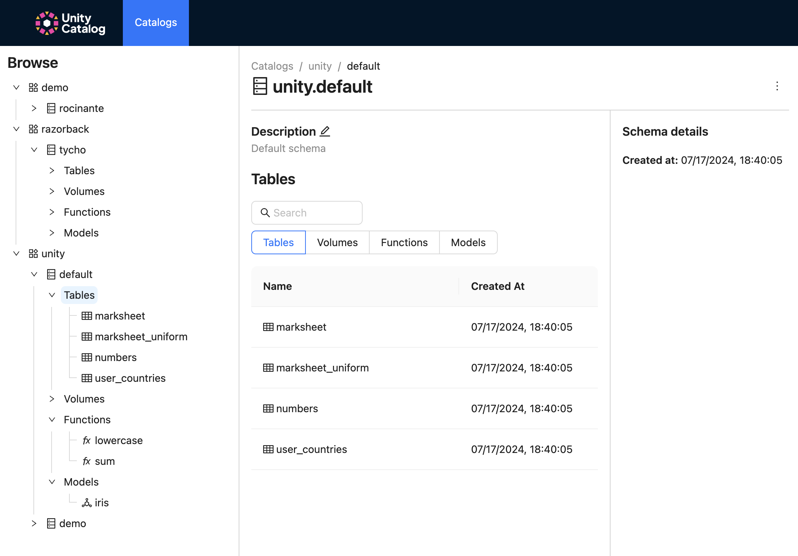

# Unity Catalog UI

The Unity Catalog UI allows you to interact with a Unity Catalog server to view or create data and AI assets.  

## Start Unity Catalog UI locally



To use the Unity Catalog UI, start a new terminal and ensure you have already started the UC server (e.g., `./bin/start-uc-server`)

!!! warning "Prerequisites"
    The Unity Catalog UI requires both [Node](https://nodejs.org/en/download/package-manager) and [Yarn](https://classic.yarnpkg.com/lang/en/docs/install).


To start the UI locally, run the following commands to start `yarn`

```
cd /ui
yarn install
yarn start
```

## Assets

### Catalogs

The following steps show how you can create, describe, and delete UC catalogs.

=== "1. List and create catalogs"
    
    After clicking the top **Catalog** button, you will see your list of catalogs.  To create a catalog, click the **Create Catalog** button to the right.

    
    

=== "2. Create catalog dialog"
    
    Specify the name and include any comments when creating your catalog.

    

=== "3. Delete a catalog"

    Click the *horizontal three dots* next to **Create Schema** button to delete your catalog.

    

<hr style="height:2px;border-width:0;color:gray;background-color:lightgrey">


### Schemas

The following steps show how you can create, describe, and delete UC schemas.

=== "1. List and create schemas"
    
    After clicking on any catalog, the main dialog contains the list of available schemas.  Click the **Create Schemas** button to the right to create a new schema.

    
    

=== "2. Create schemas dialog"
    
    Specify the name and include any comments when creating your schema.

    

=== "3. Delete a schema"

    Click the *horizontal three dots* to the rightto delete your schema.

    

<hr style="height:2px;border-width:0;color:gray;background-color:lightgrey">


### Tables

The following steps show how you can view your UC table metadata and descriptions.

=== "1. View tables in schema (1)"
    
    Click on the schema (e.g., `unity.demo`) to view its tables.

    
    
=== "2. View tables in schema (2)"
    
    Click on the schema (e.g., `unity.default`) to view its tables.

    

=== "3. View table metadata"

    Click on any table (e.g., `unity.default.marksheet`) to view its metadata.  You also have the option to delete the table via the *three horizontal dots* on the right.

    

<hr style="height:2px;border-width:0;color:gray;background-color:lightgrey">


### Volumes

The following steps show how you can view your UC volume metadata and descriptions.

=== "1. Traverse to volumes"
    
    Using the left-hand nav bar, click on *catalog > schema* (e.g., `unity` > `default`) to view the available volumes.

    
    
=== "2. View volume metadata"
    
    Click on the volume (e.g., `unity.default.txt_files`) to view its metadata.  You have the option to delete it by click on the *three horizontal dots* to the right. 

    

=== "3. Edit volume description"

    Click the edit button to change its descripton.

    

<hr style="height:2px;border-width:0;color:gray;background-color:lightgrey">


### Functions

The following steps show how you can view your UC functions metadata and descriptions.

=== "1. Traverse to functions"
    
    Using the left-hand nav bar, click on *catalog > schema* (e.g., `unity` > `default`) to view the available functions.

    
    
=== "2. View functions metadata"
    
    Click on the volume (e.g., `unity.default.lowercase`) to view its metadata.  You have the option to delete it by click on the *three horizontal dots* to the right. 

    

<hr style="height:2px;border-width:0;color:gray;background-color:lightgrey">


### Models

The following steps show how you can view your UC models and its metadata.

=== "1. Traverse to models"
    
    Using the left-hand nav bar, click on *catalog > schema* (e.g., `unity` > `default`) to view the available models.

    
    
=== "2. View model versions"
    
    Click on the model (e.g., `unity.default.iris`) to view its version(s).

    

=== "3. View model version metadata"

    Click on the model version to view its details.

    

<hr style="height:2px;border-width:0;color:gray;background-color:lightgrey">