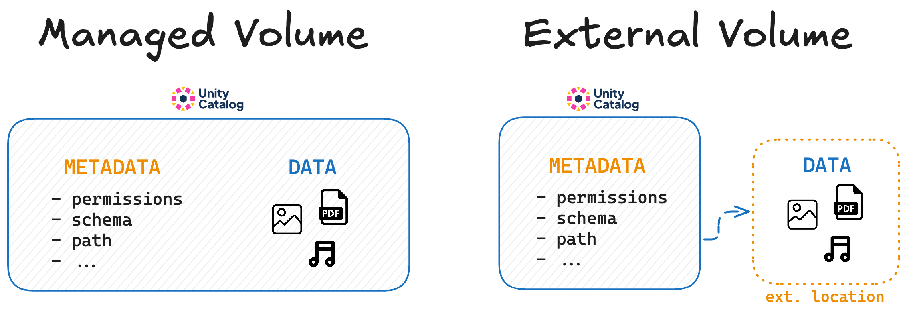
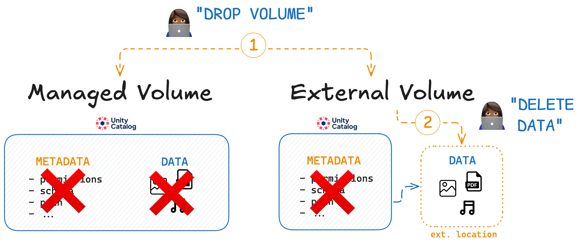

# Managed vs External Volumes

Unity Catalog supports both managed and external volumes.

A **managed volume** is a volume for which Unity Catalog manages both the metadata and the data itself, incl. creation, storage, and deletion. Data is managed at a pre-configured storage location to which Unity Catalog has full read and write access.

An **external volume** is a volume for which Unity Catalog manages _only_ the metadata and not the lifecycle of the underlying data itself. The user is responsible for data creation, storage and deletion at the external location.



## How to Create a Managed Volume

<< code >>

## Specifying the Managed Storage Location

By default, managed volumes are stored in Unity Catalog's root directory.

You can also specify locations for managed volumes at the catalog or schema level. You might want to do this for stronger isolation between schemas or catalogs, e.g. between "prod" and "dev".

<< how / code >>

Unity Catalog will search for a user-defined storage location in the following order:

- at schema level
- at catalog level
- at metastore root directory, configured during setup

## How to Create an External Volume

Use the `uc/bin volume create` command with a `storage_location` to create an external volume.

For example:

```
CODE
```

You will see << >>

```
OUTPUT
```

## Dropping Managed vs External Volumes

When you drop a managed volume from Unity Catalog, the underlying data is also removed.

When you drop an external volume from Unity Catalog, the underlying data is not touched. If you want the data to be deleted, you will have to do so manually.



## When to use which volume type

Unity Catalog gives you the freedom to use both managed and external volumes, depending on your needs.

**You may want to use managed volumes when:**

- You prefer simplicity and easy data management.
- Your data lifecycle is tightly coupled with the volume definition.
- You don't want to worry about the details of data storage.

**You may want to use external volumes when:**

- You need to manage data storage locations explicitly.
- You require data persistence independent of volume definitions.
- You need external read or write access to your data.
