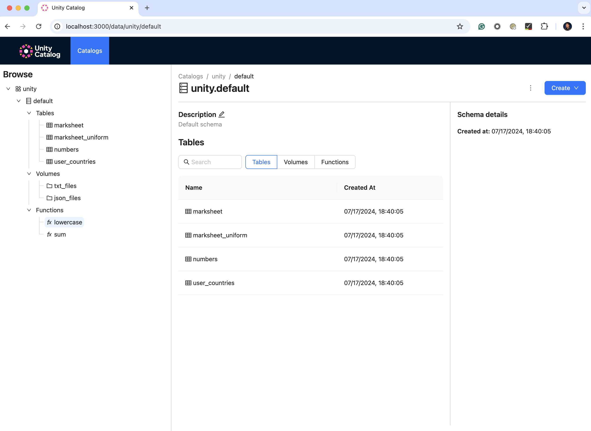

# Unity Catalog UI

Unity Catalog UI is an intuitive user interface designed to manage and interact with Unity Catalog. It facilitates handling data permissions, auditing, and resource discovery in a user-friendly manner. Through this UI, users can efficiently view, create, update, and delete resources within the Unity Catalog server.

For more details on how to use the Unity Catalog UI, please refer to the [UI Documentation](https://github.com/unitycatalog/unitycatalog/tree/main/docs/ui).

# Prerequisite

Node: https://nodejs.org/en/download/package-manager

Yarn: https://classic.yarnpkg.com/lang/en/docs/install

## Get started

Spin up a localhost Unity Catalog server (e.g., `./bin/start-uc-server`), see https://github.com/unitycatalog/unitycatalog/blob/main/README.md#run-the-uc-server

Then in the project directory, you can run:

### `yarn`

Install all the necessary dependencies

### `yarn start`

Runs the app in the development mode.\
Open [http://localhost:3000](http://localhost:3000) to view it in the browser.

The page will reload if you make edits.\
You will also see any lint errors in the console.

### Authenticate and Login

OSS Unity Catalog supports Sign in with Google. You can authenticate with Google by clicking the "Sign in with Google" button on the login page, once OAuth has been configured. To configure this, follow the steps to obtain a [Google API Client ID](https://developers.google.com/identity/gsi/web/guides/get-google-api-clientid) and configure your OAuth consent screen.

NOTE: The google client ID should match what is configured in the server.properties file on the server side. See README in root directory. In order for login to work, authentication must be enabled on server side AND UI side and users must be added to users table.

Once you have the client ID, add it to the `.env` file after `REACT_APP_GOOGLE_CLIENT_ID=` and change the `REACT_APP_GOOGLE_AUTH_ENABLED` flag from false to true. Restart yarn. 

## References

This project has been merged into the main Unity Catalog repository. Per [Merging unitycatalog-ui repo into unitycatalog (main) repo (#349)](https://github.com/unitycatalog/unitycatalog/discussions/349).